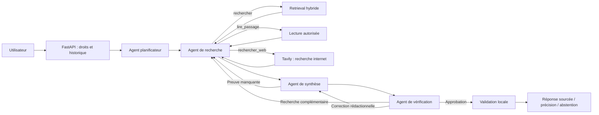

# Agentic RAG Platform

Un assistant documentaire qui transforme des PDF et CSV en réponses sourcées. Le projet associe FastAPI, MongoDB Atlas, Redis et Next.js, avec un workflow LangGraph volontairement borné.

## Le parcours



- Ingestion PDF/CSV avec découpage, IDs stables et métadonnées de propriétaire.
- Recherche textuelle et vectorielle, fusion RRF, reranking et compression locale.
- Quatre agents spécialisés : planification, recherche autonome, synthèse et vérification avec une correction maximum, avec Hugging Face.
- Budgets : 4 recherches, 6 outils et 13 appels LLM maximum, correction comprise ; 90 secondes par défaut.
- Salutation, calcul et inventaire restent disponibles sans LLM.
- Contrôle local des citations et abstention si le contrat documentaire échoue.
- Modes explicites : documents avec outils simples, documents seuls ou connaissances générales.
- Interface de chat, upload et diagnostics détaillés.

Le système est un **prototype avancé d'assistant documentaire**. Les citations ne prouvent pas à elles seules la factualité ; les PDF scannés nécessitent encore de l'OCR et la qualité métier doit être mesurée sur un corpus de référence.

## Démarrage

Copier `backend/.env.example` vers `backend/.env`, puis configurer MongoDB Atlas, Redis et le fournisseur de génération. Les index Atlas Search et Vector Search doivent exister et être queryable.

```sh
make install
make dev
```

Frontend : `http://localhost:3000`. Backend : `http://localhost:8000`.

Pour HuggingFace, configurer `LLM_PROVIDER=huggingface`, `HUGGINGFACE_API_KEY` et `HUGGINGFACE_MODEL`. Les surcharges `MODEL_*` sont facultatives. Hugging Face est le fournisseur par défaut ; aucun serveur Ollama n’est nécessaire. Pour activer la recherche internet en mode automatique, ajouter `TAVILY_API_KEY` dans `backend/.env` et redémarrer le backend.

## Vérification

```sh
make test
cd backend
.venv/bin/python -m app.evaluation.index_health
.venv/bin/python -m app.evaluation.retrieval_benchmark --verbose
.venv/bin/python -m app.evaluation.compare_workflows
```

Le diagnostic d'index est en lecture seule. Le benchmark complet utilise Atlas et HuggingFace ; il attend le corpus de référence déjà ingéré. En mode propriétaire, ajouter `--owner-id <propriétaire-du-corpus>`.

## Documentation

- [Architecture actuelle : quatre agents collaboratifs avec Hugging Face](docs/ARCHITECTURE_AGENT.md)
- [Workflow simple conservé comme référence](docs/ARCHITECTURE_SIMPLIFIEE.md)
- [Fonctionnement pas à pas](docs/FONCTIONNEMENT.md)
- [Composants du workflow](docs/AGENTS.md)
- [Pipeline RAG](docs/RAG_SYSTEM.md)
- [Évaluation](docs/EVALUATION.md)
- [Audit initial : ingestion, indexation et dysfonctionnements corrigés](docs/AUDIT_2026-09-10.md)

Le workflow simple reste accessible à l’évaluation via `ChatWorkflow(strategy="baseline")`. Les composants LLM de planification, CRAG et critique sont conservés dans `backend/app/evaluation/experimental/` pour des comparaisons hors ligne. Ils ne participent plus au chat courant.

Projet créé par Manda Surel.
