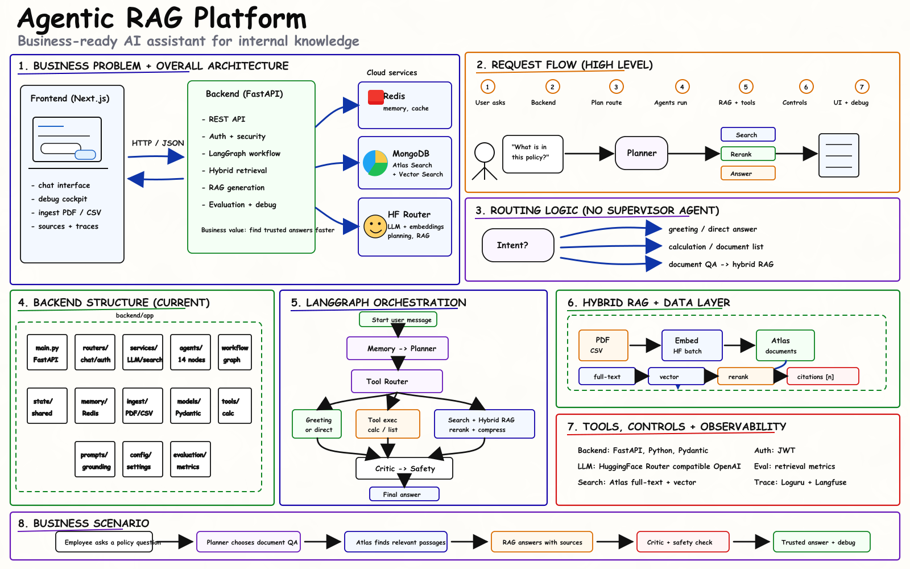

<div align="center">

# Agentic RAG Platform

**Une plateforme d'assistant documentaire intelligent pour entreprises, capable de transformer des documents internes en réponses fiables, sourcées et traçables.**




</div>

## Problème Business

Les entreprises accumulent de plus en plus de documents internes : procédures, rapports, politiques RH, contrats, supports de formation, documentation produit, fichiers CSV, PDF réglementaires ou bases de connaissance métier.

Le problème est que cette connaissance reste souvent difficile à exploiter :

- les collaborateurs perdent du temps à chercher l'information fiable ;
- les réponses varient selon la personne, le document consulté ou le niveau d'expertise ;
- les assistants IA classiques peuvent produire des réponses non sourcées ou inventées ;
- les équipes métiers ont besoin de preuves, de citations et de traçabilité ;
- les équipes techniques ont besoin d'observer ce que fait l'IA pour diagnostiquer, corriger et améliorer le système.

Ce projet répond donc à une question business simple :

**Comment permettre aux équipes d'une entreprise de poser des questions sur leurs documents internes et d'obtenir rapidement une réponse fiable, sourcée, contrôlée et traçable ?**

L'objectif n'est pas seulement de construire un chatbot. L'objectif est de réduire le temps perdu à chercher l'information, d'améliorer la qualité des réponses internes et de rendre l'utilisation de l'IA plus fiable dans des contextes où les sources comptent.

## Solution Proposée

Agentic RAG Platform transforme une base documentaire interne en assistant conversationnel capable de :

- **Répondre à des questions utilisateur** avec une interface web simple.
- **Exploiter des documents internes** grâce à un pipeline RAG hybride basé sur MongoDB Atlas : full-text search + recherche vectorielle.
- **Router intelligemment les demandes** entre réponse directe, calcul, inventaire documentaire ou recherche RAG.
- **Produire des réponses sourcées** à partir des passages retrouvés dans les documents.
- **Contrôler la réponse** avec un critic, une validation des citations et un safety guard.
- **Rendre l'exécution transparente** grâce à un cockpit de debug qui affiche la route, les agents appelés, les résultats bruts, le plan, les métriques de retrieval, le critic et les informations de safety.

La valeur business principale est :

**moins de recherche manuelle, moins de réponses inventées, plus de confiance et plus de traçabilité dans l'utilisation de l'IA sur des connaissances internes.**

## Secteurs Visés

La plateforme s'adresse surtout aux organisations où la connaissance documentaire est volumineuse, critique et doit être vérifiable.

**Support client, SaaS et équipes IT**
- Assistant interne pour les agents support.
- Recherche rapide dans les FAQ, tickets, guides produit et procédures.
- Réponses cohérentes avec sources pour réduire le temps de résolution.

**Banque, assurance et services financiers**
- Recherche dans les procédures, politiques internes et documents de conformité.
- Aide aux conseillers, équipes risk, audit ou compliance.
- Besoin fort de traçabilité, de contrôle et de réponses justifiables.

**Juridique, conformité et audit**
- Analyse documentaire, recherche de clauses, obligations ou règles internes.
- Réponses sourcées pour préparer des revues, contrôles ou audits.
- Réduction du risque lié aux réponses non vérifiées.

**Industrie, énergie et maintenance**
- Accès rapide aux manuels techniques, fiches sécurité et procédures terrain.
- Assistance aux équipes opérationnelles qui doivent trouver la bonne procédure au bon moment.
- Diminution du temps de recherche dans une documentation souvent dense.

**Santé, pharmacie et qualité**
- Recherche dans des protocoles, procédures qualité, notices ou documentation réglementaire.
- Usage pertinent pour l'assistance documentaire interne, hors diagnostic médical automatisé.
- Secteur sensible où les sources et le contrôle sont indispensables.

## Méthode De Résolution

Le projet résout le problème avec un workflow multi-agent orchestré par **LangGraph** :

```text
Utilisateur
  -> Frontend Next.js
  -> Backend FastAPI
  -> MemoryAgent
  -> LLMPlannerAgent
  -> ToolRouterAgent
  -> Search / RAG / Direct Answer
  -> LLMCriticAgent
  -> SafetyGuardAgent
  -> FinalAnswerAgent
  -> ChatResponse
```

La méthode est la suivante :

1. **Comprendre la demande** : le planner LLM identifie l’intention (avec fallback déterministe si le LLM échoue).
2. **Choisir les bons outils** : le tool router décide si la réponse doit être directe, documentaire ou RAG.
3. **Chercher les sources** : MongoDB Atlas Search récupère les documents pertinents (full-text).
4. **Améliorer le contexte** : retrieval hybride (full-text + Atlas Vector Search), reranking lexical + sémantique (embeddings HuggingFace) et compression de contexte.
5. **Générer une réponse** : le RAGAgent répond à partir des documents disponibles.
6. **Contrôler la réponse** : le critic vérifie qualité, clarté et grounding.
7. **Sécuriser la sortie** : le safety guard masque les secrets évidents.
8. **Retourner une réponse compatible frontend** : avec réponse finale, agents utilisés, métriques et traces debug.

## Architecture En Bref

**Backend**
- FastAPI pour l’API HTTP.
- LangGraph pour l’orchestration multi-agent.
- Redis Cloud pour l’historique conversationnel et le cache.
- MongoDB Atlas (Atlas Search + Atlas Vector Search) pour la recherche documentaire hybride (full-text + sémantique).
- HuggingFace Router compatible OpenAI pour les appels LLM.
- Loguru et Langfuse optionnel pour l’observabilité.

**Frontend**
- Next.js / React / TypeScript.
- Interface de chat.
- Cockpit de debug : route, agents, sorties brutes, plan, critic, safety, retrieval metrics.

**Agents Principaux**
- `MemoryAgent`
- `LLMPlannerAgent`
- `ToolRouterAgent`
- `SearchAgent`
- `HybridRetrieverAgent`
- `RerankerAgent`
- `ContextCompressionAgent`
- `RAGAgent`
- `LLMCriticAgent`
- `SafetyGuardAgent`
- `FinalAnswerAgent`

## Ce Que Le Projet Démontre

- Une architecture multi-agent claire et extensible.
- Un workflow LangGraph réel, pas seulement une orchestration manuelle.
- Un RAG progressif : recherche, reranking, compression, réponse sourcée.
- Une compatibilité API stable avec `/api/v1/chat`.
- Des champs debug utiles : `plan`, `critic_score`, `retrieval_metrics`, `safety_feedback`, `trace_id`.
- Une base pédagogique pour aller vers un système agentique plus robuste.

## Démarrage Rapide

1. Copier `backend/.env.example` vers `backend/.env` et renseigner les clés nécessaires : clé HuggingFace, URI Redis Cloud (`REDIS_URL`) et URI MongoDB Atlas (`MONGODB_URI`). Aucun conteneur local n'est requis, Redis et MongoDB tournent tous les deux en cloud (tiers gratuits).
2. Installer les dépendances (backend + frontend) :

```bash
make install
```

3. Démarrer le backend et le frontend ensemble :

```bash
make dev
```

Ça lance le backend (`:8000`) et le frontend (`:3000`) en parallèle dans le même terminal, avec un seul `Ctrl+C` pour tout arrêter. Chaque service reste aussi disponible séparément via `make backend` ou `make frontend`.

4. Ouvrir :

```text
http://localhost:3000
```

## Documentation

Pour aller plus loin :

- [Fonctionnement, pas à pas](docs/FONCTIONNEMENT.md) — comment marche le projet, du démarrage à la réponse, étape par étape.
- [Guide du projet](docs/GUIDE_PROJET.md) — architecture, stack, workflow, sécurité, limites connues, roadmap.
- [Agents](docs/AGENTS.md) — rôle et fonctionnement détaillé de chaque agent.
- [RAG — détail du pipeline et limites connues](docs/RAG_SYSTEM.md)
- [Évaluation](docs/EVALUATION.md)

## Positionnement

Ce projet est un **starter production-grade avancé** : il reste lisible et pédagogique, mais il introduit déjà les patterns importants des systèmes agentiques modernes.

Il n’est pas encore une plateforme d’entreprise complète : le reranker cross-encoder, le checkpoint persistant et l’évaluation continue restent des pistes d’évolution.
