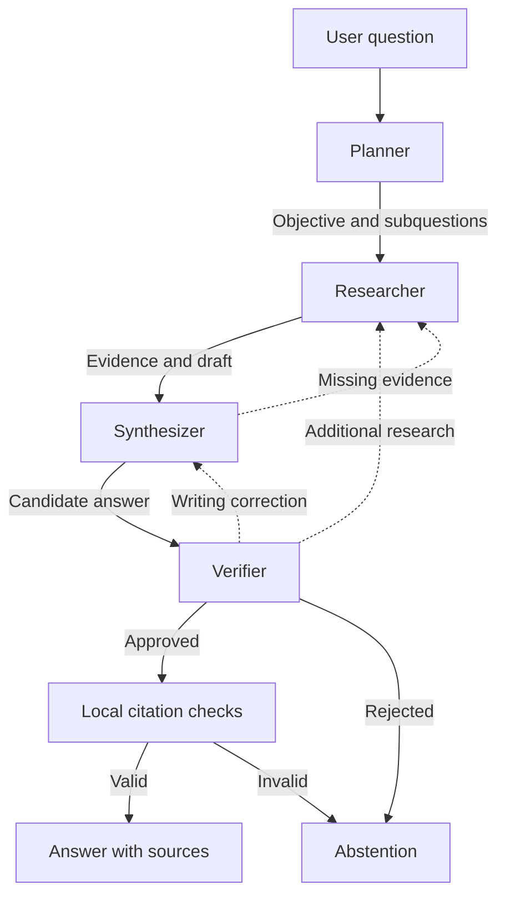
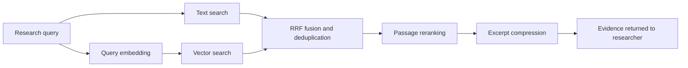

# Agentic RAG Platform

A project for **learning to build four collaborating AI agents** that answer questions using evidence from documents and the web.

The agents plan, research, draft and verify. They can request additional evidence or a targeted correction. **Hugging Face** provides the models, **LangGraph** coordinates the agents, **MongoDB Atlas** powers documentary RAG, and **Tavily** provides web search.

## 1. Understand the four agents

| Agent | Code class | Responsibility and decision |
|---|---|---|
| Planner | `PlanningAgent` | Defines an objective and one to four subquestions; sends its plan to the researcher |
| Researcher | `DocumentaryAgent` | Chooses searches and passage reads; shares evidence and a draft, asks for clarification or abstains |
| Synthesizer | `SynthesisAgent` | Writes an answer with citations; can ask the researcher for missing evidence |
| Verifier | `VerificationAgent` | Checks the answer against the evidence; approves, rejects or requests a targeted correction |

The agents share the configured Hugging Face service, with distinct prompts and structured decisions. Multiple agents do not require multiple models. A four-node LangGraph subgraph coordinates their exchanges.



Dashed arrows represent requests for additional work. **The entire team may make only one correction attempt.** If another correction is needed, the system abstains. A provider failure, timeout or invalid structured decision also prevents publication of an unverified documentary answer.

Example: the verifier notices that an answer allows two remote-work days without stating the approval conditions. It asks the researcher to find those conditions. The researcher returns another passage, the synthesizer updates the answer, and the verifier checks it again.

After the response, the frontend displays work messages, correction requests and evidence references under **Agent collaboration**. These are task exchanges, not the models' hidden reasoning, and they are not streamed live.

## 2. Where is the RAG?

Retrieval-augmented generation retrieves information, supplies it to a model as context, and produces an answer grounded in that evidence. It is part of the researcher's and synthesizer's work.

The researcher has three tools. Their existing API identifiers are retained for compatibility:

| Tool identifier | Purpose |
|---|---|
| `rechercher(query)` | Search documents indexed in MongoDB Atlas |
| `lire_passage(passage_id)` | Read an already discovered document fragment with a fresh permission check |
| `rechercher_web(query)` | Search public information through Tavily and return excerpts with URLs |

Every document search launches text and vector retrieval **in parallel**, using the same query and permissions. Their results are then fused.



Text search matches words and expressions; vector search finds passages with similar meaning. Reciprocal Rank Fusion (RRF) combines the rankings. If one branch fails, the other remains usable and degraded operation is reported. If both fail, the system reports an outage rather than claiming that no documents exist.

**These RAG stages are technical components, not additional autonomous agents.** Their historical class names are `SearchAgent`, `HybridRetrieverAgent`, `RerankerAgent` and `ContextCompressionAgent`.

## 3. Summaries, checks and reference workflows

Not every question requires the whole team.

| Component | Current use |
|---|---|
| `SummaryAgent` | Summaries or transformations of supplied text, and general answers without retrieval |
| `ToolExecutorAgent` | Arithmetic and indexed-document inventory, without LLM generation |
| `CitationValidatorAgent` | Citation presence and range checks |
| `CriticAgent` | Local publication-contract checks, separate from the LLM verifier |
| `FinalAnswerAgent` | Publishes an approved answer, clarification or abstention |
| `SafetyGuardAgent` | Masks certain recognizable secrets in the final answer |
| `RAGAgent` | Grounded generation in the simple `baseline` comparison workflow |

“Summarize this text: …” can use `SummaryAgent`. “Summarize my indexed PDF” uses the documentary team to retrieve and synthesize passages.

The older `LLMPlannerAgent`, `CorrectiveRAGAgent` and `LLMCriticAgent` remain in `backend/app/evaluation/experimental/`; they do not participate in the current chat. Memory and routing are handled by services and local rules.

## 4. Budgets and modes

| Limit | Value |
|---|---:|
| Team-wide correction attempts | At most 1 |
| Document and web searches | 2 per research pass; at most 4 overall |
| Tool calls, including searches and passage reads | At most 6 overall |
| LLM calls, including planning and correction | At most 13 overall |
| Team duration | 90 seconds by default |

A `rechercher` call counts as **one search**, even though it runs text and vector branches in parallel. Embedding calls are separate from the LLM counter. Failed attempts consume budget. A successful path with one search and no correction normally uses five LLM calls; thirteen is a ceiling, not a target.

- **`auto`**: the team may use documents and Tavily when configured; simple requests take a direct route.
- **`documents`**: documentary workflow with web search blocked by code.
- **`general`**: a general answer without document or web retrieval.

Tavily supplements RAG; it does not replace MongoDB or automatically ingest web results into the corpus.

## 5. Technology and repository layout

| Element | Technology or location |
|---|---|
| Chat, uploads and diagnostics | Next.js — `frontend/` |
| API and authentication | FastAPI — `backend/app/routers/` |
| Main orchestration | LangGraph — `backend/app/workflows/chat_workflow.py` |
| Planning, synthesis, verification and collaboration | `backend/app/agents/documentary_team.py` |
| Research agent | `backend/app/agents/documentary_agent.py` |
| Retrieval pipeline shared with evaluation | `backend/app/services/retrieval_pipeline.py` |
| Generation and embeddings | Hugging Face |
| Documents, vectors and indexes | MongoDB Atlas |
| Web search | Tavily |
| History and authentication storage | Redis |

PDF/CSV ingestion extracts text, splits it into fragments and prepares embeddings before writing to MongoDB. Fragments retain owner, source and page metadata when available. Embedding failures are reported; writing documents does not guarantee that Atlas indexes are immediately ready.

## 6. Local setup

Prerequisites: Python 3.12, Node.js/npm, Redis, a MongoDB Atlas cluster and Hugging Face access. Tavily is optional.

1. Copy `backend/.env.example` to `backend/.env` and `frontend/.env.example` to `frontend/.env.local` only if those files do not already exist.
2. Set the variables below. To run without remote observability, set `LANGFUSE_ENABLED=false`.
3. Create Atlas Search and Vector Search indexes using the configured names. The embedding model, vector dimension and index definition must match.
4. Install and start:

```sh
make install
make run
```

`make run` (also available as `make dev`) starts both services in the foreground.
Press Ctrl+C, or run `make stop` from another terminal, to stop both services.
After editing `backend/.env`, run `make stop` followed by `make run`.
These commands manage only the services started by `make run`; stop any older,
individually started servers in their original terminals first. Redis must be
started separately. `make backend` and `make frontend` remain available for
running the services individually.

| Backend variable | Purpose |
|---|---|
| `LLM_PROVIDER=huggingface` | Selected generation provider |
| `HUGGINGFACE_API_KEY` | Hugging Face account key |
| `HUGGINGFACE_MODEL` | Generation model available to the account; `MODEL_*` overrides are optional |
| `MODEL_EMBEDDING`, `EMBEDDING_DIMENSIONS` | Embedding model and vector dimension |
| `MONGODB_URI` | MongoDB Atlas connection |
| `REDIS_URL` | Redis connection |
| `AUTH_SECRET_KEY` | Environment-specific authentication secret |
| `TAVILY_API_KEY` | Enables web search in automatic mode |
| `DOCUMENTARY_AGENT_TIMEOUT_SECONDS` | Global team timeout, 90 seconds by default |

The frontend uses `NEXT_PUBLIC_BACKEND_URL`. Defaults: frontend at `http://localhost:3000`, backend at `http://localhost:8000`. Provider keys remain on the backend. Restart it after changing its `.env`.

Sign in, upload a text-based PDF or compatible CSV, then ask about the document. To test the web, select automatic mode and explicitly request an internet search.

For Render, [render.yaml](render.yaml) describes the backend. Enter secrets in Render's environment settings, including Hugging Face and Tavily keys: the local `.env` is not transferred automatically.

## 7. Testing and evaluation

Local tests use provider doubles to verify collaboration, permissions, citations, budgets, failures, parallel search and request isolation.

```sh
APP_ENV=test LANGFUSE_ENABLED=false LANGFUSE_TRACING_ENABLED=false LOG_TO_FILE=false \
HUGGINGFACE_API_KEY='' TAVILY_API_KEY='' MONGODB_URI='' make test
```

For diagnostics and evaluation against real services:

```sh
cd backend
.venv/bin/python -m app.evaluation.index_health
.venv/bin/python -m app.evaluation.retrieval_benchmark --verbose
.venv/bin/python -m app.evaluation.compare_workflows
```

Index diagnostics are read-only. The retrieval benchmark requires the ingested reference corpus and ready indexes; in owner mode, supply `--owner-id <corpus-owner>`. The workflow comparator retains answers, latency and counters to compare the simple baseline with the collaborative team. Real evaluations call configured providers.

**Passing tests does not prove factual accuracy.** Citation checks and LLM review do not replace independently annotated business questions. Measure real parallel-search latency and the benefit of collaboration on the target corpus.

## 8. Limitations and documentation

This remains a learning prototype: no OCR for scanned PDFs, character-based chunking, incomplete file-version replacement and limited context capacity. Quality also depends on the configured models and their ability to follow JSON contracts.

Project-authored interface text, diagnostics, documentation and default response instructions are in English. Imported content and multilingual regression fixtures retain their original language. Existing tool identifiers and documentation paths remain stable for compatibility.

- [Collaborative architecture and agent contracts](docs/ARCHITECTURE_AGENT.md)
- [Agents and code components](docs/AGENTS.md)
- [Step-by-step operation](docs/FONCTIONNEMENT.md)
- [RAG, parallel search, ingestion and indexes](docs/RAG_SYSTEM.md)
- [Evaluation and metric limitations](docs/EVALUATION.md)
- [Simple reference workflow](docs/ARCHITECTURE_SIMPLIFIEE.md)
- [Initial project audit](docs/AUDIT_2026-09-10.md)

Project created by Manda Surel.
