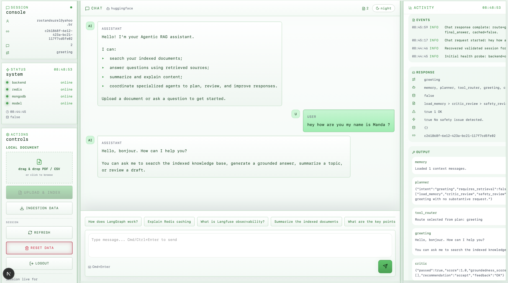

<div align="center">

# Agentic RAG Platform

**Une plateforme RAG agentique, multi-agent et observable, construite avec FastAPI, LangGraph, Redis Cloud, MongoDB Atlas et Next.js.**




</div>

## Problématique

Les assistants IA classiques répondent souvent de manière trop générique : ils ne savent pas toujours quand chercher dans des documents, quand répondre directement, quand citer leurs sources, ni comment vérifier la qualité ou la sécurité de leur réponse.

Ce projet cherche à résoudre cette problématique : **comment construire un assistant conversationnel capable de router une demande, exploiter une base documentaire, produire une réponse sourcée, vérifier sa qualité et rester inspectable par le développeur ?**

## Problème Traité

Le système répond à trois besoins concrets :

- **Répondre à des questions utilisateur** avec une interface web simple.
- **Exploiter des documents internes** grâce à un pipeline RAG hybride basé sur MongoDB Atlas (full-text + recherche vectorielle).
- **Rendre l’exécution transparente** grâce à un cockpit de debug qui affiche la route, les agents appelés, les résultats bruts, le plan, les métriques de retrieval, le critic et le safety guard.

L’objectif n’est pas seulement de faire un chatbot, mais de montrer une architecture agentique structurée, progressive et proche d’un système production-grade.

## Méthode De Résolution

Le projet résout le problème avec un workflow multi-agent orchestré par **LangGraph** :

```text
Utilisateur
  -> Frontend Next.js
  -> Backend FastAPI
  -> MemoryAgent
  -> LLMPlannerAgent
  -> ToolRouterAgent
  -> Search / RAG / Direct Answer
  -> LLMCriticAgent
  -> SafetyGuardAgent
  -> FinalAnswerAgent
  -> ChatResponse
```

La méthode est la suivante :

1. **Comprendre la demande** : le planner LLM identifie l’intention (avec fallback déterministe si le LLM échoue).
2. **Choisir les bons outils** : le tool router décide si la réponse doit être directe, documentaire ou RAG.
3. **Chercher les sources** : MongoDB Atlas Search récupère les documents pertinents (full-text).
4. **Améliorer le contexte** : retrieval hybride (full-text + Atlas Vector Search), reranking lexical + sémantique (embeddings HuggingFace) et compression de contexte.
5. **Générer une réponse** : le RAGAgent répond à partir des documents disponibles.
6. **Contrôler la réponse** : le critic vérifie qualité, clarté et grounding.
7. **Sécuriser la sortie** : le safety guard masque les secrets évidents.
8. **Retourner une réponse compatible frontend** : avec réponse finale, agents utilisés, métriques et traces debug.

## Architecture En Bref

**Backend**
- FastAPI pour l’API HTTP.
- LangGraph pour l’orchestration multi-agent.
- Redis Cloud pour l’historique conversationnel et le cache.
- MongoDB Atlas (Atlas Search + Atlas Vector Search) pour la recherche documentaire hybride (full-text + sémantique).
- HuggingFace Router compatible OpenAI pour les appels LLM.
- Loguru et Langfuse optionnel pour l’observabilité.

**Frontend**
- Next.js / React / TypeScript.
- Interface de chat.
- Cockpit de debug : route, agents, sorties brutes, plan, critic, safety, retrieval metrics.

**Agents Principaux**
- `MemoryAgent`
- `LLMPlannerAgent`
- `ToolRouterAgent`
- `SearchAgent`
- `HybridRetrieverAgent`
- `RerankerAgent`
- `ContextCompressionAgent`
- `RAGAgent`
- `LLMCriticAgent`
- `SafetyGuardAgent`
- `FinalAnswerAgent`

## Ce Que Le Projet Démontre

- Une architecture multi-agent claire et extensible.
- Un workflow LangGraph réel, pas seulement une orchestration manuelle.
- Un RAG progressif : recherche, reranking, compression, réponse sourcée.
- Une compatibilité API stable avec `/api/v1/chat`.
- Des champs debug utiles : `plan`, `critic_score`, `retrieval_metrics`, `safety_feedback`, `trace_id`.
- Une base pédagogique pour aller vers un système agentique plus robuste.

## Démarrage Rapide

1. Copier `backend/.env.example` vers `backend/.env` et renseigner les clés nécessaires : clé HuggingFace, URI Redis Cloud (`REDIS_URL`) et URI MongoDB Atlas (`MONGODB_URI`). Aucun conteneur local n'est requis, Redis et MongoDB tournent tous les deux en cloud (tiers gratuits).
2. Installer les dépendances (backend + frontend) :

```bash
make install
```

3. Démarrer le backend et le frontend ensemble :

```bash
make dev
```

Ça lance le backend (`:8000`) et le frontend (`:3000`) en parallèle dans le même terminal, avec un seul `Ctrl+C` pour tout arrêter. Chaque service reste aussi disponible séparément via `make backend` ou `make frontend`.

4. Ouvrir :

```text
http://localhost:3000
```

## Documentation

Pour aller plus loin :

- [Fonctionnement, pas à pas](docs/FONCTIONNEMENT.md) — comment marche le projet, du démarrage à la réponse, étape par étape.
- [Guide du projet](docs/GUIDE_PROJET.md) — architecture, stack, workflow, sécurité, limites connues, roadmap.
- [Agents](docs/AGENTS.md) — rôle et fonctionnement détaillé de chaque agent.
- [RAG — détail du pipeline et limites connues](docs/RAG_SYSTEM.md)
- [Évaluation](docs/EVALUATION.md)

## Positionnement

Ce projet est un **starter production-grade avancé** : il reste lisible et pédagogique, mais il introduit déjà les patterns importants des systèmes agentiques modernes.

Il n’est pas encore une plateforme d’entreprise complète : le reranker cross-encoder, le checkpoint persistant et l’évaluation continue restent des pistes d’évolution.
