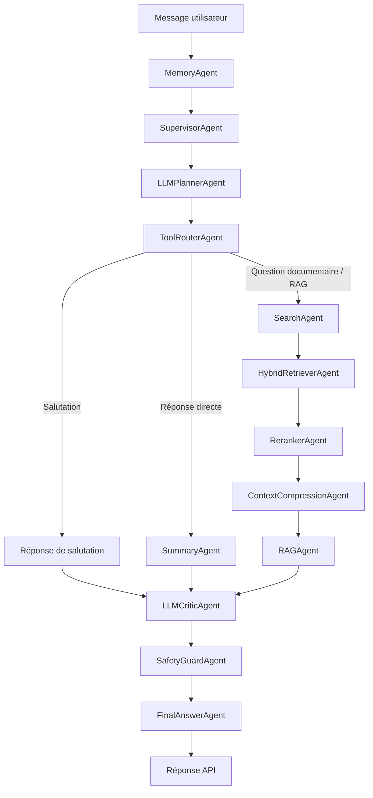

# Les agents IA du projet Agentic RAG Platform

Ce document présente les agents utilisés par le projet, leur rôle et leur place dans le workflow de conversation.

## Vue d'ensemble

Le backend utilise **LangGraph** pour orchestrer **13 agents actifs**. Chaque agent reçoit l'état partagé de la conversation (`GraphState`), réalise une tâche précise, puis enrichit cet état pour l'étape suivante.

Le projet contient également deux implémentations déterministes de support : `CriticAgent` et `PlannerAgent`. Elles ne sont pas des nœuds indépendants du workflow principal actuel.

## Liste des agents actifs

### 1. MemoryAgent

**Rôle :** préparer la mémoire de la conversation.

Il charge l'historique enregistré dans Redis. Si aucun historique Redis n'est disponible, il utilise celui envoyé par le frontend. Il place ensuite ce contexte dans l'état partagé afin que les autres agents puissent tenir compte des messages précédents.

**Résultat principal :** `conversation_context`.

### 2. SupervisorAgent

**Rôle :** donner une première orientation à la demande de l'utilisateur.

Il analyse le message et propose une route initiale, par exemple : salutation, recherche, résumé, RAG, planification ou correction. Il utilise normalement le LLM, puis applique des règles par mots-clés si le modèle est indisponible.

**Résultat principal :** une route initiale servant d'indication au planner.

### 3. LLMPlannerAgent

**Rôle :** transformer la demande en plan d'exécution structuré.

Il demande au LLM de produire un objet `PlannerDecision` validé par Pydantic. Ce plan précise notamment l'intention détectée, les étapes à exécuter, les outils nécessaires et la nécessité éventuelle d'utiliser la recherche ou le RAG. Un fallback déterministe permet au workflow de continuer si l'appel LLM échoue.

**Résultats principaux :** `planner_decision`, `intent`, `plan` et `tools`.

### 4. ToolRouterAgent

**Rôle :** convertir le plan en chemin LangGraph exécutable.

Il lit la décision du planner et sélectionne une route sûre : salutation, réponse directe, recherche documentaire, pipeline RAG ou fallback. Il évite ainsi d'appeler des agents inutiles pour la requête courante.

**Résultat principal :** la route définitive utilisée par les transitions du graphe.

### 5. SearchAgent

**Rôle :** rechercher les documents pertinents dans Elasticsearch.

Il envoie la question de l'utilisateur au service de recherche, conserve les résultats structurés et produit également une version textuelle lisible. Les titres, fichiers, pages, scores et extraits restent disponibles pour les étapes RAG suivantes.

**Résultats principaux :** `search_results` et `search_output`.

### 6. HybridRetrieverAgent

**Rôle :** fusionner les résultats de plusieurs méthodes de recherche.

Il combine les résultats full-text d'Elasticsearch avec ceux d'un moteur vectoriel optionnel. Il déduplique les documents, les trie par score et limite leur nombre. Le stockage vectoriel est actuellement optionnel grâce au port `VectorStorePort`.

**Résultats principaux :** une liste normalisée de documents et les métriques de retrieval.

### 7. RerankerAgent

**Rôle :** reclasser les documents selon leur pertinence.

Il améliore l'ordre des résultats à partir du score de recherche et du recouvrement lexical entre la question, le titre et l'extrait du document. Seuls les meilleurs documents sont conservés pour la génération.

**Résultat principal :** `reranked_results`.

### 8. ContextCompressionAgent

**Rôle :** réduire le contexte envoyé au LLM.

Il conserve les passages les plus utiles tout en respectant une taille maximale. Les références aux sources, aux fichiers et aux pages sont préservées. La compression est locale par défaut, avec une option de compression par LLM.

**Résultat principal :** `compressed_context`.

### 9. SummaryAgent

**Rôle :** produire une réponse directe sans recherche documentaire.

Malgré son nom, cet agent ne sert pas uniquement à résumer. Il répond directement à l'utilisateur à partir du message et de l'historique de conversation. Il est utilisé pour les résumés, les corrections, les demandes générales et les fallbacks qui ne nécessitent pas le RAG.

**Résultats principaux :** `summary_output` et `draft_answer`.

### 10. RAGAgent

**Rôle :** générer une réponse fondée sur les documents récupérés.

Il transmet au LLM la question et le contexte documentaire compressé. Il construit une réponse ancrée dans les sources et conserve les références nécessaires pour rendre la réponse vérifiable. Si aucun document n'est disponible, il produit un message de fallback explicite.

**Résultats principaux :** `rag_output` et `draft_answer`.

### 11. LLMCriticAgent

**Rôle :** contrôler la qualité de la réponse provisoire.

Il évalue la pertinence, la clarté et l'ancrage documentaire de la réponse. Sa sortie structurée contient un score, une décision, les problèmes détectés et une recommandation. Selon le résultat, le workflow peut accepter la réponse ou tenter une nouvelle génération. Si le LLM critic échoue, il utilise `CriticAgent` comme solution de secours.

**Résultats principaux :** `critic_passed`, `critic_feedback`, `critic_score` et les métriques d'évaluation.

### 12. SafetyGuardAgent

**Rôle :** vérifier la sécurité de la réponse avant son envoi.

Il recherche notamment les clés API, tokens, mots de passe et clés privées qui pourraient apparaître dans la réponse. Les secrets détectés sont remplacés par `[REDACTED_SECRET]`. Cette vérification utilise des règles locales par défaut et peut être complétée par une revue LLM optionnelle.

**Résultats principaux :** `safety_passed`, `safety_feedback` et, si nécessaire, une réponse expurgée.

### 13. FinalAnswerAgent

**Rôle :** préparer la réponse finale retournée par l'API.

Il choisit la meilleure sortie disponible parmi la réponse déjà finalisée, le brouillon, la sortie RAG, la réponse directe ou la sortie de recherche. Il ajoute les notes du critic et du safety guard lorsque cela est nécessaire.

**Résultat principal :** `final_answer`.

## Agents de support et de secours

### CriticAgent

`CriticAgent` effectue une validation locale et déterministe. Il vérifie notamment qu'une réponse existe, qu'elle est suffisamment développée et que les sources sont visibles lorsqu'une réponse RAG est attendue. Il sert de fallback interne à `LLMCriticAgent`.

### PlannerAgent

`PlannerAgent` est l'ancienne implémentation déterministe de la planification. Le workflow principal utilise désormais `LLMPlannerAgent`, qui possède son propre mécanisme de fallback. Le fichier est conservé comme implémentation simple de référence ou de secours.

## Nœuds techniques du graphe

Le workflow contient aussi des nœuds qui ne correspondent pas à des classes d'agents autonomes :

- `greeting` produit une salutation simple ;
- `prepare_rag_retry` prépare une nouvelle tentative du `RAGAgent` ;
- `prepare_summary_retry` prépare une nouvelle tentative du `SummaryAgent`.

Le graphe possède donc **16 nœuds**, dont **13 agents actifs** et **3 nœuds techniques**.

## Emplacement du code

- Implémentations des agents : [`backend/app/agents/`](backend/app/agents/)
- Orchestration LangGraph : [`backend/app/workflows/chat_workflow.py`](backend/app/workflows/chat_workflow.py)
- État partagé : [`backend/app/state/graph_state.py`](backend/app/state/graph_state.py)
- Modèles des résultats : [`backend/app/models/chat_models.py`](backend/app/models/chat_models.py)

