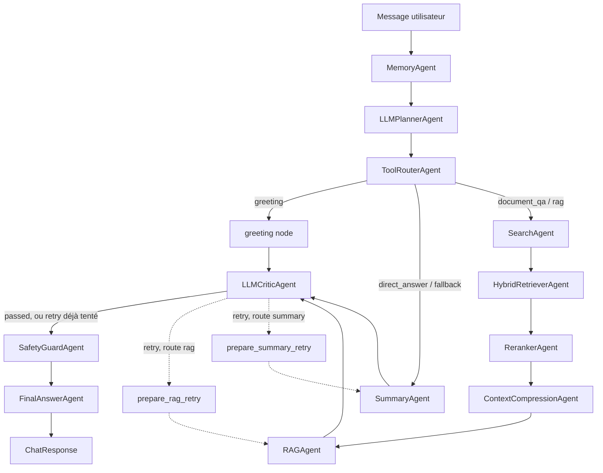

# Les agents du projet — rôle et fonctionnement détaillé

Ce document présente en détail chacun des agents du workflow LangGraph : leur rôle, ce qu'ils lisent/écrivent dans l'état partagé (`GraphState`), leur logique interne réelle, et leur comportement en cas d'échec. Pour la vue d'ensemble du projet (stack, architecture, sécurité), voir [GUIDE_PROJET.md](GUIDE_PROJET.md). Pour le détail du pipeline RAG et ses limites connues, voir [RAG_SYSTEM.md](RAG_SYSTEM.md).

Contenu vérifié directement contre le code source (`backend/app/agents/`, `backend/app/workflows/chat_workflow.py`) le 2026-08-14.

---

## Vue d'ensemble

Le graphe LangGraph (`ChatWorkflow._build_graph()`) compte **15 nœuds** :
- **12 nœuds adossés à une classe d'agent dédiée** (détaillés ci-dessous) ;
- **1 classe de secours interne**, `CriticAgent`, appelée par `LLMCriticAgent` si le LLM échoue — ce n'est pas un nœud du graphe en soi ;
- **3 nœuds techniques** sans classe propre : `greeting`, `prepare_rag_retry`, `prepare_summary_retry`.

Chaque agent reçoit l'état partagé de la conversation (`GraphState`), réalise une tâche précise, puis enrichit cet état pour l'étape suivante. Chaque agent ajoute aussi sa sortie brute dans `state.agent_results` (visible dans le cockpit de debug du frontend) et son nom dans `state.agents_used`.

**Il n'y a pas d'agent superviseur.** Une version antérieure du projet avait un `SupervisorAgent` placé entre `MemoryAgent` et le planner ; il a été retiré (commit `remove supervisor agent`) car sa sortie n'était qu'un indice textuel toujours écrasé par `ToolRouterAgent` — un appel LLM en plus, sans effet sur le graphe. **Il n'y a pas non plus de classe `PlannerAgent` séparée** : le fallback déterministe du planner est une méthode interne de `LLMPlannerAgent` (`_fallback_decision`), pas un agent à part.



### Tableau récapitulatif

| # | Agent | Nœud graphe | Rôle en une ligne | Fallback si échec |
|---|---|---|---|---|
| 1 | `MemoryAgent` | `memory` | Charge l'historique de conversation | — (pas d'appel externe risqué) |
| 2 | `LLMPlannerAgent` | `planner` | Décide de l'intention et du plan d'exécution | Classification déterministe par mots-clés |
| 3 | `ToolRouterAgent` | `tool_router` | Convertit le plan en route de graphe concrète | Route `fallback` par défaut |
| 4 | `SearchAgent` | `search` | Recherche full-text dans MongoDB Atlas | Continue avec `search_results=[]` |
| 5 | `HybridRetrieverAgent` | `hybrid_retriever` | Fusionne full-text + recherche vectorielle | Continue avec le seul full-text |
| 6 | `RerankerAgent` | `reranker` | Réordonne les documents (lexical + sémantique) | Retombe sur le score lexical seul |
| 7 | `ContextCompressionAgent` | `context_compression` | Réduit le contexte avant envoi au LLM | Compression locale (déjà le mode par défaut) |
| 8 | `SummaryAgent` | `summary` | Réponse directe sans recherche documentaire | — |
| 9 | `RAGAgent` | `rag` | Génère une réponse ancrée dans les documents | Retombe sur `search_output` brut |
| 10 | `LLMCriticAgent` | `critic` | Évalue qualité/pertinence/ancrage de la réponse | Bascule sur `CriticAgent` (règles déterministes) |
| 11 | `SafetyGuardAgent` | `safety` | Masque les secrets évidents avant finalisation | — (règles locales, pas d'appel LLM par défaut) |
| 12 | `FinalAnswerAgent` | `final_answer` | Assemble la réponse finale envoyée au frontend | — |

---

## 1. MemoryAgent

**Fichier :** [`memory_agent.py`](../backend/app/agents/memory_agent.py) · **Nœud :** `memory` · **Premier nœud du graphe**

**Rôle :** préparer la mémoire de la conversation avant que les autres agents n'en aient besoin.

**Fonctionnement :** injecte un `RedisMemoryService`. À l'exécution, il lit deux sources possibles :
1. l'historique transmis par le frontend dans `ChatRequest.history` ;
2. l'historique stocké en Redis pour ce `conversation_id` (clé gérée par `RedisMemoryService`).

Le frontend est **prioritaire** : `state.conversation_context = request_context or stored_context`. Si le frontend envoie un historique (même vide côté intention), il l'emporte sur ce qui est stocké côté serveur — ce choix garde la compatibilité avec l'UI existante.

**Entrées :** `state.conversation_id`, `state.history` (venant de `ChatRequest`).
**Sorties :** `state.conversation_context` (liste de messages `{role, content}`).

**Limite connue :** pas de mémoire sémantique longue durée — uniquement l'historique brut de la conversation courante.

---

## 2. LLMPlannerAgent

**Fichier :** [`llm_planner_agent.py`](../backend/app/agents/llm_planner_agent.py) · **Nœud :** `planner`

**Rôle :** transformer la demande utilisateur en plan d'exécution structuré. C'est **le seul point de classification d'intention** du workflow.

**Fonctionnement :**
1. Compresse `state.conversation_context` en texte court.
2. Appelle `LLMService.plan(user_message, conversation_history)`, qui demande au LLM un JSON validé par le modèle Pydantic `PlannerDecision` (`intent`, `requires_retrieval`, `requires_rag`, `requires_critic`, `requires_safety`, `steps`, `tools`, `reason`).
3. Si l'appel échoue (erreur réseau, JSON invalide, validation Pydantic échouée) : bascule sur `_fallback_decision()`, une classification déterministe par mots-clés appliquée directement sur `state.user_message` :
   - salutation (`hello`, `hi`, `bonjour`, `salut`, ...) → `intent="greeting"` ;
   - mots liés au résumé (`summary`, `résume`, ...) → `intent="summarization"` ;
   - mots liés à la planification (`plan`, `steps`, `roadmap`, `étapes`, ...) → `intent="planning"` ;
   - mots liés à la correction (`correct`, `review`, `critic`, `corrige`, ...) → `intent="correction"` ;
   - sinon, par défaut → `intent="document_qa"` avec `requires_retrieval=True`, `requires_rag=True` et le plan complet (`search_documents` → `hybrid_retrieve` → `rerank_results` → `compress_context` → `generate_grounded_answer` → `critic_review` → `safety_review` → `final_answer`).

**Entrées :** `state.user_message`, `state.conversation_context`.
**Sorties :** `state.planner_decision`, `state.intent`, `state.plan`, `state.tools`, `state.metadata["planner_reason"]`, `state.metadata["planner_source"]` (`"llm"` ou `"fallback"`).

**Pourquoi c'est important :** le fallback n'est pas un simple filet de sécurité anecdotique — c'est la garantie que le chat continue de fonctionner même sans fournisseur LLM disponible pour le planning.

---

## 3. ToolRouterAgent

**Fichier :** [`tool_router_agent.py`](../backend/app/agents/tool_router_agent.py) · **Nœud :** `tool_router`

**Rôle :** convertir la décision abstraite du planner en route concrète que le graphe LangGraph sait exécuter.

**Fonctionnement :** lit `state.planner_decision.intent` et le mappe via une table statique (`ROUTES`) :

```python
ROUTES = {
    "greeting": "greeting",
    "direct_answer": "direct_answer", "summarization": "direct_answer",
    "analysis": "direct_answer", "correction": "direct_answer", "planning": "direct_answer",
    "document_qa": "document_qa",
    "unknown": "fallback",
}
```

Mais les **flags du planner priment** sur ce mapping simple : si `decision.requires_rag` est vrai, la route devient `"rag"` quel que soit l'intent ; sinon si `decision.requires_retrieval` est vrai, elle devient `"document_qa"`. C'est cette route (`state.route`) que lisent ensuite les `conditional_edges` du graphe.

**Entrées :** `state.planner_decision`.
**Sorties :** `state.route`, `state.intent`, `state.metadata["tool_route"]`.

---

## 4. SearchAgent

**Fichier :** [`search_agent.py`](../backend/app/agents/search_agent.py) · **Nœud :** `search` (`swallow_errors=True`)

**Rôle :** recherche full-text dans MongoDB Atlas.

**Fonctionnement :** envoie `state.user_message` tel quel à `SearchService.search()`, qui exécute une agrégation `$search` (Atlas Search, `compound`/`text`) sur les champs `title` (boost ×2), `snippet`, `category`, limitée à 5 résultats (valeur codée en dur — voir [RAG_SYSTEM.md](RAG_SYSTEM.md), erreur #1). Formate ensuite les résultats en texte lisible.

**Entrées :** `state.user_message`.
**Sorties :** `state.search_results` (liste structurée de `SearchResult` : titre, snippet, score, fichier, page), `state.search_output` (texte lisible).

**Comportement en cas d'échec :** le nœud est configuré `swallow_errors=True` dans `chat_workflow.py` — si MongoDB est indisponible ou l'index Atlas Search n'existe pas, le workflow continue avec `search_results=[]` au lieu de planter.

---

## 5. HybridRetrieverAgent

**Fichier :** [`hybrid_retriever_agent.py`](../backend/app/agents/hybrid_retriever_agent.py) · **Nœud :** `hybrid_retriever` (`swallow_errors=True`)

**Rôle :** fusionner la recherche full-text avec la recherche vectorielle.

**Fonctionnement :** appelle `vector_store.similarity_search(state.user_message)`. Dans `ChatWorkflow`, ce store est toujours `MongoVectorStore` (implémentation de `VectorStorePort`, Atlas Vector Search sur le champ `embedding`, 384 dimensions) — la recherche vectorielle est donc **active par défaut**, pas seulement une interface préparée. Fusionne ensuite `full_text_results + vector_results` :
- déduplique par clé `(titre, fichier ou source, page)` ;
- trie par score décroissant ;
- tronque à `limit` (8 par défaut).

**Entrées :** `state.search_results` (déjà rempli par `SearchAgent`), `state.user_message`.
**Sorties :** `state.search_results` (remplacé par la version fusionnée/dédupliquée), `state.retrieval_metrics.full_text_count/vector_count/hybrid_count`.

**Comportement en cas d'échec :** si Mongo est injoignable ou le calcul d'embedding de la requête échoue, `MongoVectorStore.similarity_search` retourne `[]` — l'agent continue avec les seuls résultats full-text (dégradation silencieuse).

**Limite connue :** risque de collision de déduplication pour les documents CSV (clé de dédup incomplète) — détail dans [RAG_SYSTEM.md](RAG_SYSTEM.md), erreur #3.

---

## 6. RerankerAgent

**Fichier :** [`reranker_agent.py`](../backend/app/agents/reranker_agent.py) · **Nœud :** `reranker` (`swallow_errors=True`)

**Rôle :** réordonner et filtrer les documents avant de les envoyer au LLM.

**Fonctionnement :** combine deux scores par document :
1. **Score lexical** (toujours calculé) : score full-text brut + `0.25` par mot de la question retrouvé dans le titre/snippet.
2. **Score sémantique** (si `SEMANTIC_RERANKER_ENABLED=true`) : similarité cosinus entre l'embedding de la question et celui du document, calculée en un seul appel batch via `HuggingFaceEmbeddingService`.

Score final = `lexical + 2.0 × cosinus` (`SEMANTIC_WEIGHT = 2.0`, valeur fixée arbitrairement — voir [RAG_SYSTEM.md](RAG_SYSTEM.md), erreur #6). Trie et tronque à `MAX_RAG_DOCUMENTS`.

**Entrées :** `state.search_results`, `state.user_message`.
**Sorties :** `state.reranked_results`, métriques `retrieved_count`, `reranked_count`, `top_score`, `sources_used`, `semantic_reranking_used`.

**Comportement en cas d'échec :** si l'appel d'embeddings échoue (quota, timeout, modèle indisponible), repli silencieux sur le score lexical seul — aucune exception ne remonte à l'utilisateur.

---

## 7. ContextCompressionAgent

**Fichier :** [`context_compression_agent.py`](../backend/app/agents/context_compression_agent.py) · **Nœud :** `context_compression` (`swallow_errors=True`)

**Rôle :** réduire le contexte documentaire envoyé au LLM pour maîtriser coût et taille de prompt.

**Fonctionnement :** prend `state.reranked_results` (ou `search_results` en repli), garde les labels source (titre/fichier/page) et tronque progressivement les snippets pour respecter `MAX_RAG_CONTEXT_CHARS` (4000 par défaut). Deux modes :
- `use_llm=False` (mode réellement actif dans `ChatWorkflow`) : compression locale, troncature caractère par caractère document par document, puis une seconde troncature dure sur la chaîne finale assemblée.
- `use_llm=True` : demanderait à `LLMService.compress_context()` de sélectionner les passages utiles — ce mode existe dans le code mais n'est **jamais activé** par défaut.

**Entrées :** `state.reranked_results` / `state.search_results`.
**Sorties :** `state.compressed_context`, `state.retrieval_metrics.compressed_context_chars`.

**Limite connue :** la troncature est naïve, pas une sélection intelligente — une information pertinente située après le point de coupure dans un snippet long est perdue sans signal. Détail : [RAG_SYSTEM.md](RAG_SYSTEM.md), erreurs #5 et #7.

---

## 8. SummaryAgent

**Fichier :** [`summary_agent.py`](../backend/app/agents/summary_agent.py) · **Nœud :** `summary` (`swallow_errors=True`)

**Rôle :** produire une réponse directe **sans** recherche documentaire.

**Fonctionnement :** malgré son nom, ne fait pas qu'un résumé au sens strict — appelle `LLMService.summarize(user_message, conversation_context)`, dont le prompt demande au LLM de répondre directement à la question en tenant compte du contexte de conversation. Utilisé pour les réponses directes, résumés, corrections, demandes générales et comme fallback quand la route n'est ni `greeting` ni documentaire.

**Entrées :** `state.user_message`, `state.conversation_context`.
**Sorties :** `state.summary_output`, `state.draft_answer` (important : c'est ce que le critic et le safety guard analysent quand le workflow ne passe pas par RAG).

---

## 9. RAGAgent

**Fichier :** [`rag_agent.py`](../backend/app/agents/rag_agent.py) · **Nœud :** `rag` (`swallow_errors=True`)

**Rôle :** générer une réponse ancrée dans les documents récupérés.

**Fonctionnement :**
1. Utilise `state.reranked_results` (ou `search_results` en repli) comme source de vérité.
2. **Garde-fou anti-hallucination** : si aucun document n'est disponible, renvoie directement un message explicite (« I could not find relevant indexed documents... ») **sans jamais appeler le LLM**.
3. Sinon, construit le contexte (`compressed_context` en priorité, sinon formatage direct des documents) et appelle `LLMService.grounded_answer(question, documents, historique)` — un prompt qui interdit explicitement au LLM de répondre en dehors des documents fournis.
4. Ajoute toujours une section `Sources:` (3 meilleurs documents) à la réponse, que l'appel LLM réussisse ou échoue.

**Entrées :** `state.reranked_results`/`search_results`, `state.compressed_context`, `state.conversation_context`.
**Sorties :** `state.rag_output`, `state.draft_answer`.

**Comportement en cas d'échec :** si `grounded_answer()` échoue, retombe sur `state.search_output` brut plutôt que de planter tout le workflow.

**Limite connue :** `metadata["sources_count"]` utilise `len(state.search_results)` (résultats bruts) et non `len(documents)` réellement utilisés après reranking — métrique trompeuse. Détail : [RAG_SYSTEM.md](RAG_SYSTEM.md), erreur #4.

---

## 10. LLMCriticAgent

**Fichier :** [`llm_critic_agent.py`](../backend/app/agents/llm_critic_agent.py) · **Nœud :** `critic` (déclaré sous le nom `"CriticAgent"` dans `chat_workflow.py`, sans `swallow_errors`)

**Rôle :** contrôler la qualité de la réponse provisoire avant de la laisser sortir.

**Fonctionnement :** prend la meilleure réponse candidate disponible (`draft_answer` > `rag_output` > `summary_output` > `search_output` > `final_answer`) et appelle `LLMService.critic_review(user_message, draft_answer, sources)`, qui retourne un `CriticReview` structuré : `passed`, `score`, `groundedness_score`, `relevance_score`, `clarity_score`, `issues`, `recommendation` (`accept`/`revise`/`retrieve_more`/`fallback`), `feedback`.

**Fallback si le LLM échoue :** délègue à `CriticAgent` (voir section support ci-dessous), puis reconstruit un `CriticReview` synthétique à partir de son verdict binaire.

**Entrées :** `state.draft_answer`/`rag_output`/`summary_output`, `state.compressed_context`/`search_output` (comme "sources").
**Sorties :** `state.critic_passed`, `state.critic_feedback`, `state.critic_score`, `state.evaluation["critic"]`.

**Conséquence directe :** c'est cette sortie qui pilote le routage post-critic dans `chat_workflow.py` — accepté → safety ; refusé + pas encore de retry → `prepare_rag_retry`/`prepare_summary_retry` ; refusé + retry déjà tenté → safety quand même (boucle bornée à une tentative).

---

## 11. SafetyGuardAgent

**Fichier :** [`safety_guard_agent.py`](../backend/app/agents/safety_guard_agent.py) · **Nœud :** `safety` (sans `swallow_errors`)

**Rôle :** dernier garde-fou avant la finalisation — détecter et masquer les secrets évidents.

**Fonctionnement :** applique trois regex sur la réponse candidate :

```python
SECRET_PATTERNS = [
    r"(?i)(api[_-]?key|secret|password|token)\s*[:=]\s*['\"]?([A-Za-z0-9_\-]{12,})",
    r"(?i)bearer\s+[A-Za-z0-9_\-.]{20,}",
    r"-----BEGIN [A-Z ]*PRIVATE KEY-----",
]
```

Toute correspondance est remplacée par `[REDACTED_SECRET]`. Une revue LLM optionnelle existe (`use_llm=True`) pour une analyse plus nuancée, mais **n'est pas activée par défaut** dans `ChatWorkflow` — le comportement réel est purement local (regex), donc rapide et sans coût LLM.

**Entrées :** `state.final_answer`/`draft_answer`/`rag_output`/`summary_output`.
**Sorties :** `state.safety_passed`, `state.safety_feedback`, `state.evaluation["safety"]` ; si rédaction, propage la version nettoyée vers `draft_answer`, `rag_output`, `summary_output`, `final_answer`.

**Limite connue :** reste léger — ne remplace pas une politique DLP complète, une revue de prompt injection ou un audit de logs.

---

## 12. FinalAnswerAgent

**Fichier :** [`final_answer_agent.py`](../backend/app/agents/final_answer_agent.py) · **Nœud :** `final_answer` (dernier nœud avant `END`)

**Rôle :** assembler la réponse finale envoyée au frontend. Ne génère aucun nouveau contenu — un pur agrégateur.

**Fonctionnement :** choisit la première réponse non vide dans cet ordre de priorité : `final_answer` (déjà défini par le safety guard si rédaction) → `draft_answer` → `rag_output` → `summary_output` → `search_output` → message générique de repli. Ajoute ensuite, si pertinent :
- une note `Safety note: ...` si `safety_passed=False` ;
- une note `Validation note: ...` si `critic_passed=False` et que le feedback n'est pas simplement `"OK"`.

**Entrées :** tous les champs de sortie précédents de `GraphState`.
**Sorties :** `state.final_answer` (repris tel quel par `ChatWorkflow.run()` comme `ChatResponse.answer`).

---

## Agent de secours interne : CriticAgent

**Fichier :** [`critic_agent.py`](../backend/app/agents/critic_agent.py) · **N'est pas un nœud du graphe** — instancié et appelé directement par `LLMCriticAgent`.

**Rôle :** validation locale, déterministe et bornée, utilisée uniquement si le critic LLM échoue.

**Fonctionnement :** applique des règles simples sur la réponse candidate :
- réponse non vide ? sinon → `"No draft answer was produced."`
- route `rag`/`parallel` mais `search_results` vide ? sinon → `"...expects document grounding, but no document was found."`
- route documentaire mais pas de section `"Sources:"` dans la réponse ? sinon → note sur les sources manquantes.
- réponse de moins de 12 caractères ? sinon → `"...too short to be useful."`

`critic_passed` devient vrai seulement si aucune de ces règles n'a déclenché de remarque.

---

## Nœuds techniques sans agent dédié

Trois nœuds du graphe n'ont pas de classe d'agent propre — ils sont définis directement dans `chat_workflow.py` :

- **`greeting`** : construit une réponse de salutation statique (« Hello, bonjour. How can I help you? ... ») et la place dans `final_answer`/`draft_answer`. Ne fait aucun appel externe.
- **`prepare_rag_retry`** : marque `state.correction_attempted = True`, enregistre un `AgentResult` explicatif, puis renvoie vers `RAGAgent`. Utilisé quand le critic refuse une réponse issue de la route `rag`.
- **`prepare_summary_retry`** : même mécanisme, mais renvoie vers `SummaryAgent`. Utilisé quand le critic refuse une réponse issue d'une route directe (`summary`/`simple_llm`/`planning`/`correction`).

Ces deux nœuds de retry garantissent que la boucle de correction reste **bornée à un seul essai** : `correction_attempted` est vérifié par `_route_after_critic()` avant d'autoriser un nouveau retry.

---

## Pour aller plus loin

- [GUIDE_PROJET.md](GUIDE_PROJET.md) — architecture globale, stack technique, `GraphState`, sécurité, configuration, quickstart.
- [RAG_SYSTEM.md](RAG_SYSTEM.md) — détail du pipeline RAG (agents 4 à 9 ci-dessus) et 7 limites connues identifiées dans le code, avec fichier:ligne.
- [EVALUATION.md](EVALUATION.md) — framework d'évaluation branché sur `ChatWorkflow`.
