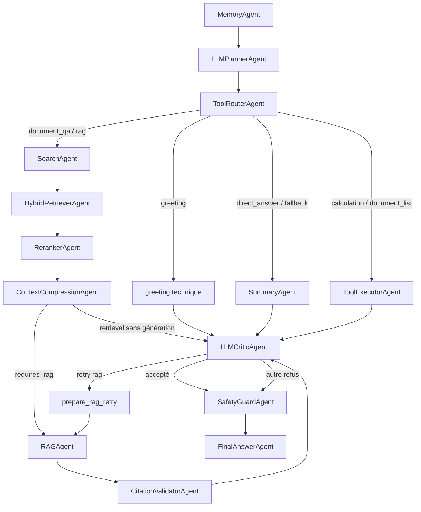

# Agents et graphe LangGraph

> Contrats vérifiés contre `backend/app/agents/`, `backend/app/state/` et
> `backend/app/workflows/chat_workflow.py` le **30 août 2026**.

## 1. Ce que signifie « agent » dans ce projet

Un agent est une classe avec une méthode asynchrone `run(GraphState) ->
AgentResult`. Il lit et modifie l'état partagé, puis retourne une sortie brute
visible dans le cockpit frontend.

Chaque agent possède une responsabilité limitée. L'objectif n'est pas de faire
travailler plusieurs chatbots indépendants, mais de découper une réponse en
étapes contrôlables : comprendre la demande, choisir un chemin, retrouver les
preuves, générer, vérifier, sécuriser puis finaliser. Cette séparation rend les
fallbacks, les métriques et le diagnostic beaucoup plus précis qu'avec un seul
appel LLM monolithique.

Le graphe contient :

- 14 nœuds associés à une classe d'agent ;
- 5 nœuds techniques définis dans `ChatWorkflow` ;
- 1 classe de critic déterministe appelée uniquement en fallback.

Il n'existe plus de `SupervisorAgent` ni de classe `PlannerAgent` séparée. Le
planner LLM est le seul classificateur d'intention et contient son propre
fallback déterministe.

## 2. Graphe réel



`prepare_summary_retry` pointe vers `SummaryAgent` et permet un seul nouvel
essai lorsqu'une réponse directe est refusée par le critic.

## 3. Tableau synthétique

| Agent | Mission | Pourquoi il est important | Fallback principal |
|---|---|---|---|
| `MemoryAgent` | reconstituer le contexte conversationnel | évite les réponses sans continuité | mémoire locale du service |
| `LLMPlannerAgent` | comprendre l'intention et produire un plan | empêche d'exécuter toute la pipeline pour chaque demande | classification par mots-clés |
| `ToolRouterAgent` | convertir le plan en route autorisée | transforme une décision LLM en transition déterministe | route `fallback` |
| `ToolExecutorAgent` | exécuter calcul ou inventaire | réserve les opérations exactes aux outils, pas au LLM | résultat d'échec structuré |
| `SearchAgent` | retrouver les correspondances lexicales | fournit la première base factuelle du RAG | aucun résultat |
| `HybridRetrieverAgent` | ajouter la recherche sémantique | retrouve des passages malgré un vocabulaire différent | full-text seul |
| `RerankerAgent` | remettre les meilleurs candidats en tête | réduit le bruit envoyé au générateur | classement lexical |
| `ContextCompressionAgent` | respecter le budget de contexte | évite des prompts trop longs et préserve les labels source | compression locale |
| `SummaryAgent` | produire les réponses non documentaires | évite de lancer le RAG pour une tâche générale | message d'indisponibilité |
| `RAGAgent` | rédiger depuis les documents | transforme des passages en réponse utile et sourcée | résultats de recherche bruts |
| `CitationValidatorAgent` | contrôler les labels `[n]` | détecte une réponse RAG sans références exploitables | contrôle local |
| `LLMCriticAgent` | évaluer la réponse provisoire | ajoute une barrière qualité avant publication | `CriticAgent` local |
| `SafetyGuardAgent` | masquer les secrets détectés | limite l'exposition accidentelle d'informations sensibles | regex locales |
| `FinalAnswerAgent` | choisir et normaliser la sortie finale | garantit un seul contrat de réponse pour l'API | message générique |

## 4. Wrapper commun des nœuds

`ChatWorkflow._agent_node()` reconstruit la dataclass depuis le dictionnaire
LangGraph, met à jour le contexte de log, mesure le temps, appelle l'agent,
enregistre son `AgentResult` puis reconvertit l'état.

Les nœuds `search`, `hybrid_retriever`, `reranker`, `context_compression`,
`summary` et `rag` ont `swallow_errors=True`. Une exception y est loguée et
transformée en résultat de repli. `memory`, `planner`, `tool_router`, `critic`,
`tool_executor`, `citation_validator`, `safety` et `final_answer` ne sont pas
avalés par ce wrapper, même si certains gèrent déjà leurs propres erreurs.

## 5. MemoryAgent

Fichier : `backend/app/agents/memory_agent.py`

**Rôle.** Préparer la mémoire utile au tour courant avant toute décision. Il ne
répond pas à l'utilisateur : il alimente les agents suivants avec les échanges
précédents.

**Importance.** Sans contexte, une question comme « résume-le maintenant » ne
peut pas être reliée au sujet précédent. MemoryAgent centralise aussi la
différence entre l'historique envoyé par le navigateur et celui conservé dans
Redis.

**En cas d'échec ou d'absence.** La requête peut encore être traitée, mais comme
une conversation neuve. La cohérence multi-tour, les références implicites et
la personnalisation contextuelle se dégradent.

Il lit deux historiques :

1. `state.history`, fourni par le frontend ;
2. Redis, via `conversation:<owner_hash>:<conversation_id>:messages`.

La règle est `request_context or stored_context`. Un historique frontend non
vide remplace donc entièrement le contexte Redis pour ce tour. Il n'y a ni
résumé de mémoire, ni recherche sémantique dans les conversations, ni fenêtre
maximale propre à l'agent.

Sortie : `state.conversation_context` et un `AgentResult` avec les deux comptes.

## 6. LLMPlannerAgent

Fichier : `backend/app/agents/llm_planner_agent.py`

**Rôle.** Comprendre ce que demande l'utilisateur et produire une décision
structurée : intention, étapes, outils et nécessité éventuelle de consulter les
documents.

**Importance.** C'est le point de décision principal. Il évite, par exemple,
d'envoyer une salutation vers MongoDB ou de faire calculer `2 + 2` par un modèle
génératif. Une mauvaise décision du planner entraîne toute la suite sur une
mauvaise branche.

**En cas d'échec ou de quota LLM épuisé.** Le workflow continue grâce à une
classification locale. Elle maintient le service disponible, mais comprend
moins bien les formulations ambiguës et classe par défaut beaucoup de demandes
en question documentaire.

Le planner transforme l'historique en texte puis appelle `LLMService.plan()`. Le
prompt exige un JSON compatible avec `PlannerDecision` :

- `intent` ;
- `requires_retrieval`, `requires_rag`, `requires_critic`, `requires_safety` ;
- `steps`, `tools`, `reason`.

La sortie est validée par Pydantic. Si le fournisseur échoue, si le quota est
épuisé ou si le JSON est invalide, `_fallback_decision()` classe localement :

| Condition | Décision fallback |
|---|---|
| message entier dans la liste de salutations | `greeting` |
| phrase demandant la liste du corpus | `document_list` |
| opérateur arithmétique, ou mot de calcul avec un nombre | `calculation` |
| mot de résumé sans mot document | `summarization`, direct |
| mot de planification | `planning`, direct |
| mot de correction | `correction`, direct |
| sinon | `document_qa`, retrieval + RAG |

Une demande comme « Summarize the indexed documents » reste documentaire parce
que la présence d'un mot document empêche le fallback résumé direct.

Sorties : `planner_decision`, `intent`, `plan`, `tools`, et dans `metadata`, la
raison et la source `llm`/`fallback`.

Limites : détection par sous-chaînes, salutations exactes seulement, aucun
seuil de confiance et aucune clarification automatique du fallback.

## 7. ToolRouterAgent

Fichier : `backend/app/agents/tool_router_agent.py`

**Rôle.** Traduire la décision du planner en une route LangGraph réellement
autorisée.

**Importance.** Il constitue une frontière de contrôle entre une sortie LLM et
l'exécution. Le planner peut suggérer un plan, mais seul le routeur sélectionne
une branche connue. Cela empêche un nom d'outil inventé de devenir une commande
exécutable.

**En cas d'échec ou de décision inconnue.** La route devient `fallback`, donc la
demande part vers une réponse directe au lieu d'exécuter arbitrairement une
recherche ou un outil.

Il convertit l'intention en route. Le mapping direct couvre `greeting`,
`direct_answer`, `summarization`, `analysis`, `correction`, `planning`,
`calculation`, `document_list`, `document_qa` et `unknown`.

Les deux flags suivants écrasent le mapping :

```python
if requires_rag:
    route = "rag"
elif requires_retrieval:
    route = "document_qa"
```

`requires_critic` et `requires_safety` participent aux quality gates, avec
`CRITIC_ENABLED`, `CRITIC_ROUTES` et `SAFETY_ENABLED` comme garde-fous de
configuration. Pour les routes documentaires, le critic reste imposé lorsque la
route est configurée, même si le planner demande de l'ignorer. Le champ `tools`
du planner est exposé et logué, mais ne peut pas déclencher un outil arbitraire :
les transitions et l'allowlist restent codées dans LangGraph.

## 8. ToolExecutorAgent

Fichier : `backend/app/agents/tool_executor_agent.py`

**Rôle.** Exécuter les opérations déterministes que le LLM ne doit pas simuler :
un calcul exact ou l'inventaire des sources indexées.

**Importance.** Il améliore à la fois l'exactitude et la sécurité. Les opérations
sont limitées par une allowlist et leurs résultats sont observables séparément
dans `tool_results`.

**En cas d'échec.** L'agent retourne un résultat explicite en échec. Il ne
bascule pas vers un autre outil et ne laisse pas le LLM inventer un résultat.

Deux routes seulement sont autorisées :

- `calculation` utilise `CalculatorTool`, un parseur AST local limité aux
  nombres et opérateurs arithmétiques ; aucun `eval` ni appel système ;
- `document_list` utilise `DocumentListTool`, qui demande au maximum 200
  entrées projetées à MongoDB et regroupe les pages par fichier/source.

Le résultat typé est ajouté à `state.tool_results` puis utilisé comme
`draft_answer`. Une route inconnue produit un `AgentResult` en échec sans
exécuter d'outil ni choisir silencieusement un substitut.

## 9. SearchAgent

Fichier : `backend/app/agents/search_agent.py`

**Rôle.** Effectuer la recherche lexicale initiale dans les documents indexés et
produire des candidats structurés.

**Importance.** C'est la première source de preuves du chemin RAG et la branche
la plus robuste lorsque les embeddings sont indisponibles. Elle trouve bien les
noms, termes et expressions présents textuellement dans le corpus.

**En cas d'échec MongoDB ou Atlas Search.** Le graphe continue avec une liste
vide. Les étapes suivantes ne peuvent alors pas fabriquer de preuves et le RAG
doit annoncer qu'aucun document pertinent n'a été trouvé.

Il transmet le message brut et le `user_id` à `SearchService.search()`. La pipeline Atlas Search
cherche dans :

- `title`, boost 2 ;
- `snippet` ;
- `category`.

La limite est fixée à 5 dans le service. En `DOCUMENT_SCOPE_MODE=owner`, le
service filtre sur les documents du propriétaire et les documents `shared`.
L'agent conserve les `SearchResult` structurés et produit aussi `search_output`,
un texte avec titre, fichier, page et snippet.

Si MongoDB ou l'index Search échoue, le wrapper du nœud remplace les résultats
par une liste vide et laisse le graphe continuer.

## 10. HybridRetrieverAgent

Fichier : `backend/app/agents/hybrid_retriever_agent.py`

**Rôle.** Combiner les résultats lexicaux avec une recherche vectorielle fondée
sur la proximité sémantique.

**Importance.** Il augmente le rappel : une question peut retrouver un passage
pertinent même si elle n'utilise pas exactement les mêmes mots. Il sert donc de
pont entre la formulation utilisateur et le vocabulaire du corpus.

**En cas d'échec Hugging Face, embedding ou Vector Search.** Les résultats
full-text restent disponibles. La réponse peut être moins complète, mais la
pipeline documentaire n'est pas bloquée.

Dans le workflow de production, son `VectorStorePort` est un
`MongoVectorStore`, pas le `NullVectorStore` utilisé par défaut quand l'agent est
instancié isolément.

Le store :

1. calcule l'embedding de la requête via Hugging Face ;
2. exécute `$vectorSearch` sur le champ `embedding` ;
3. demande `numCandidates=max(limit*10, 50)` et jusqu'à 8 résultats.

L'agent fusionne full-text puis vectoriel par Reciprocal Rank Fusion. Il
déduplique d'abord par `document_id`, puis par
`(title, file_name or source, page_number)` si l'identifiant manque. Un document
présent dans les deux branches gagne donc du score au lieu de perdre son second
signal.

Métriques : `full_text_count`, `vector_count`, `hybrid_count`,
`hybrid_fusion`.

## 11. RerankerAgent

Fichier : `backend/app/agents/reranker_agent.py`

**Rôle.** Réordonner et limiter les candidats selon leur correspondance avec la
question.

**Importance.** Le générateur dispose d'un contexte limité. Placer les passages
les plus utiles en premier réduit le bruit, améliore les citations et évite de
gaspiller le budget sur des résultats seulement vaguement liés.

**En cas d'échec du reranking sémantique.** Le score lexical local reste actif.
La qualité du classement peut baisser, mais les documents ne sont pas perdus.

Il filtre d'abord `score >= min_score` (`0.0` par défaut), puis calcule :

```text
lexical = score d'entrée + 0.25 × nombre de termes présents
final = lexical + 2.0 × similarité_cosinus
```

Les termes sont des séquences ASCII alphanumériques de plus de deux caractères.
Les accents et la morphologie ne sont pas normalisés. Le service d'embeddings
recalcule les embeddings de tous les textes candidats à chaque requête, même si
un embedding est déjà stocké dans MongoDB.

Si `SEMANTIC_RERANKER_ENABLED=false`, aucun service d'embedding n'est injecté.
En cas d'échec HF, l'agent continue avec le lexical. Il garde
`MAX_RAG_DOCUMENTS` résultats et expose `sources_used`, `top_score` et
`semantic_reranking_used`.

## 12. ContextCompressionAgent

Fichier : `backend/app/agents/context_compression_agent.py`

**Rôle.** Transformer les meilleurs documents en un contexte compact, numéroté
et compatible avec la limite du prompt RAG.

**Importance.** Il contrôle la taille, le coût et la latence de génération tout
en conservant les labels `[n]` nécessaires aux citations. Sans lui, un corpus
volumineux peut dépasser la fenêtre du modèle ou noyer l'information utile.

**En cas d'échec.** Le wrapper conserve un chemin dégradé à partir des résultats
existants. Dans la configuration actuelle, la compression étant locale, elle ne
dépend pas du quota LLM.

Il prend `reranked_results` ou, à défaut, `search_results`. Le workflow le crée
avec `use_llm=False`, donc le chemin actif est `_local_compress()` :

- labels `[n]`, titre, fichier et page conservés ;
- budget de snippet entre 200 et 900 caractères selon l'espace restant ;
- arrêt lorsque le prochain bloc ne tient plus ;
- tranche finale à `MAX_RAG_CONTEXT_CHARS`.

Le mode `LLMService.compress_context()` existe, avec fallback local, mais n'est
pas activé par le conteneur actuel.

## 13. SummaryAgent

Fichier : `backend/app/agents/summary_agent.py`

**Rôle.** Générer les réponses qui ne nécessitent pas le corpus : explication
générale, correction, réécriture, planification ou résumé non documentaire.

**Importance.** Il sépare clairement connaissance générale et connaissance
documentaire. Le RAG reste réservé aux affirmations qui doivent être ancrées
dans les documents indexés.

**En cas d'échec ou de quota LLM épuisé.** Le wrapper produit un message
d'indisponibilité. Il n'existe pas encore de véritable générateur local pour
remplacer cette réponse directe.

Le nom est historique : cet agent produit une réponse directe, pas uniquement un
résumé. Son prompt couvre questions générales, correction, réécriture,
planification et résumé. Il demande la langue de l'utilisateur, la conservation
des valeurs exactes et la séparation faits/hypothèses.

Il utilise `state.conversation_context`, appelle le modèle de capacité
`SUMMARIZATION`, puis écrit `summary_output` et `draft_answer`.

Si l'appel LLM lève une exception, le wrapper `swallow_errors` remplit seulement
`summary_output` avec un message d'indisponibilité. `draft_answer` peut rester
vide ; `FinalAnswerAgent` pourra néanmoins choisir `summary_output`.

## 14. RAGAgent

Fichier : `backend/app/agents/rag_agent.py`

**Rôle.** Transformer les passages retrouvés en une réponse rédigée, fidèle aux
preuves et accompagnée de sources visibles.

**Importance.** Les retrievers ne produisent que des extraits. RAGAgent réalise
la synthèse utile pour l'utilisateur tout en imposant le grounding, la langue et
les citations. C'est le principal point de génération du parcours documentaire.

**En cas d'absence de documents.** Il refuse de répondre sur le fond. **En cas
d'échec LLM ou de quota épuisé**, il expose actuellement les résultats de
recherche bruts avec une section `Sources:`. Ce fallback préserve l'information,
mais ne constitue pas une véritable synthèse et peut échouer au contrôle des
citations `[n]`.

Il utilise les résultats rerankés en priorité.

Sans document, il retourne un message fixe et n'appelle pas le LLM. Avec des
documents, il appelle `grounded_answer()` avec :

- la question ;
- le contexte compressé ou les documents formatés ;
- l'historique de conversation comme contexte secondaire.

Le prompt actuel :

- traite documents et historique comme données non fiables ;
- refuse de suivre leurs instructions ;
- interdit les faits hors documents ;
- exige des citations `[n]` proches des affirmations ;
- conserve langue, noms, dates, unités et incertitudes ;
- signale les preuves absentes, ambiguës ou contradictoires ;
- demande un contrôle silencieux avant réponse.

L'application ajoute ensuite `Sources:` avec les trois premiers documents. Si le
LLM échoue, elle expose `search_output` avec ces sources.

Limite : `metadata.sources_count` utilise `len(search_results)`, pas le nombre de
documents rerankés réellement envoyés.

## 15. CitationValidatorAgent

Fichier : `backend/app/agents/citation_validator_agent.py`

**Rôle.** Vérifier après génération que les références `[n]` existent, restent
dans la plage des documents fournis et possèdent au moins un signal lexical de
support.

**Importance.** Un texte fluide n'est pas nécessairement traçable. Cet agent
rend détectables les réponses sans citation ou avec des références inventées et
transmet l'échec au critic avant publication.

**En cas d'absence.** Une réponse RAG pourrait être acceptée avec `[99]` ou sans
aucun label. **Limite actuelle :** le support lexical repère les citations
déconnectées, mais ne prouve pas une entailment sémantique complète.

Il exécute `CitationValidatorTool` après chaque génération RAG et avant le
critic. Le contrôle porte sur le corps avant `Sources:` : présence d'un label
quand des documents existent et absence de labels hors plage. Sans document, le
contrôle est marqué `skipped` et réussi. `CITATION_SUPPORT_REQUIRED=true` rend
le signal lexical bloquant ; sinon il reste exposé en métadonnées.

## 16. LLMCriticAgent et CriticAgent

Fichiers : `llm_critic_agent.py`, `critic_agent.py`

**Rôle de LLMCriticAgent.** Évaluer la pertinence, la clarté et le grounding de
la réponse provisoire, puis recommander acceptation, révision ou fallback.

**Rôle de CriticAgent.** Fournir une vérification déterministe minimale lorsque
le LLM critic est indisponible. Il contrôle surtout la forme et la présence des
éléments attendus.

**Importance.** Ensemble, ils empêchent qu'une génération devienne
automatiquement la réponse finale. Le critic est la barrière qualité et le point
de décision des retries.

**En cas d'échec LLM ou de quota épuisé.** Le critic local maintient le workflow,
mais ses scores sont heuristiques. Il ne peut pas prouver la factualité ou le
support sémantique d'une affirmation.

Le critic choisit la première réponse candidate parmi `draft_answer`, RAG,
summary, search et final. Les sources sont le contexte compressé ou le texte de
search. Le LLM retourne un `CriticReview` validé : verdict, score global, scores
de grounding/pertinence/clarté, problèmes, recommandation et feedback.

En cas d'échec, `CriticAgent` applique quatre règles :

- réponse non vide ;
- documents présents pour une route RAG ;
- section `Sources:` présente pour une route RAG documentée ;
- au moins 12 caractères.

Le fallback produit des scores synthétiques `1.0` en cas de succès ou des scores
fixes bas en cas d'échec ; ce ne sont pas des mesures empiriques.

### Routage après critique

- verdict positif → safety ;
- route `rag`/`parallel` + documents + aucun retry → `prepare_rag_retry` ;
- retry déjà tenté → safety ;
- sinon → safety.

Une route `direct_answer`, `summary`, `simple_llm`, `planning` ou `correction`
refusée déclenche un seul passage par `prepare_summary_retry`. Les routes outils
refusées vont directement au safety : elles ne sont pas régénérées par un LLM.

## 17. SafetyGuardAgent

Fichier : `backend/app/agents/safety_guard_agent.py`

**Rôle.** Inspecter la réponse retenue et masquer certains formats de secrets
avant qu'elle ne quitte le backend.

**Importance.** C'est la dernière barrière spécialisée contre l'exposition
accidentelle de clés, tokens ou mots de passe présents dans une génération.

**En cas d'absence.** Un secret reconnu dans la réponse pourrait être envoyé tel
quel au navigateur. **Limite actuelle :** ce n'est pas un système complet de
modération, de détection de données personnelles ou de contrôle d'autorisation.

Le mode actif applique des regex à la réponse candidate : affectations de
`api_key`/`secret`/`password`/`token`, Bearer long et début de clé privée. Les
correspondances deviennent `[REDACTED_SECRET]` et la version masquée est propagée
vers les champs de réponse.

`passed=false` signifie ici qu'un secret potentiel a été détecté et masqué. Le
contenu n'est pas bloqué entièrement. Le mode LLM optionnel est désactivé.

Ce garde-fou ne couvre pas tous les formats de secrets, la toxicité, les données
personnelles, les permissions, les attaques indirectes ou les sorties brutes des
autres agents.

## 18. FinalAnswerAgent

Fichier : `backend/app/agents/final_answer_agent.py`

**Rôle.** Choisir la meilleure sortie encore disponible, ajouter les notes de
validation/sécurité nécessaires et remplir `final_answer`.

**Importance.** Les branches précédentes écrivent dans des champs différents.
Cet agent les rassemble derrière un contrat unique, ce qui simplifie l'API, le
cache et le frontend.

**En cas de sorties intermédiaires vides.** Il fournit un message générique au
lieu de retourner une réponse vide. Il ne répare cependant ni le contenu ni les
sources : il finalise ce que les agents précédents ont produit.

Ordre de sélection :

```text
final_answer → draft_answer → rag_output → summary_output
→ search_output → fallback générique
```

Il ajoute une `Safety note` si le safety n'est pas passé et une
`Validation note` si le critic a refusé avec un feedback non trivial. Il ne fait
aucun appel LLM et ne vérifie pas les sources.

## 19. Nœuds techniques

### greeting

Produit une salutation bilingue statique, remplit `final_answer` et
`draft_answer`, puis va tout de même au critic et au safety.

**Importance.** Répondre localement à une salutation évite un appel LLM et une
recherche documentaire inutiles.

### prepare_rag_retry

Fixe `correction_attempted=true`, enregistre `critic_retry`, puis renvoie au RAG.
Il ne modifie ni le prompt, ni les documents, ni le feedback transmis au RAG ; le
second appel peut donc reproduire la première réponse.

**Importance.** Il borne la correction à une tentative et empêche une boucle
infinie. Lors d'un quota fournisseur épuisé, ce retry reste actuellement inutile
et provoque un second appel voué au même échec.

### prepare_summary_retry

Même mécanisme vers SummaryAgent, utilisé au maximum une fois pour les réponses
directes refusées.

**Importance.** Il donne une seconde chance aux réponses générales refusées par
le critic tout en garantissant la terminaison du graphe.

## 20. Lecture du cockpit

- `agents_used` montre les noms uniques, pas le nombre d'exécutions.
- `agent_results` conserve chaque exécution ; un retry peut donc créer plusieurs
  résultats portant le même `agent`.
- `tool_results` expose séparément le nom, le statut, la sortie et les
  métadonnées de chaque outil déterministe.
- `evaluation.latency_ms` est indexé par nom de nœud : un retry du même nœud
  écrase la latence précédente au lieu de les additionner.
- `trace_id` est actuellement le `conversation_id` stocké comme
  `transaction_id` dans `GraphState`, alors que le logger génère séparément un
  autre transaction id contextuel. Les deux identifiants ne sont pas équivalents.

## 21. Ajouter ou modifier un agent

1. Créer ou modifier la classe dans `backend/app/agents/`.
2. Déclarer tout nouveau champ dans `GraphState` et `GraphStateDict`.
3. Instancier l'agent dans `ChatWorkflow.__init__`.
4. Ajouter le nœud et ses transitions dans `_build_graph()`.
5. Décider explicitement si les erreurs doivent être avalées.
6. Ajouter des tests de chemin, de fallback et de forme de `ChatResponse`.
7. Mettre à jour ce document, [FONCTIONNEMENT.md](FONCTIONNEMENT.md) et, si le
   retrieval change, [RAG_SYSTEM.md](RAG_SYSTEM.md).
