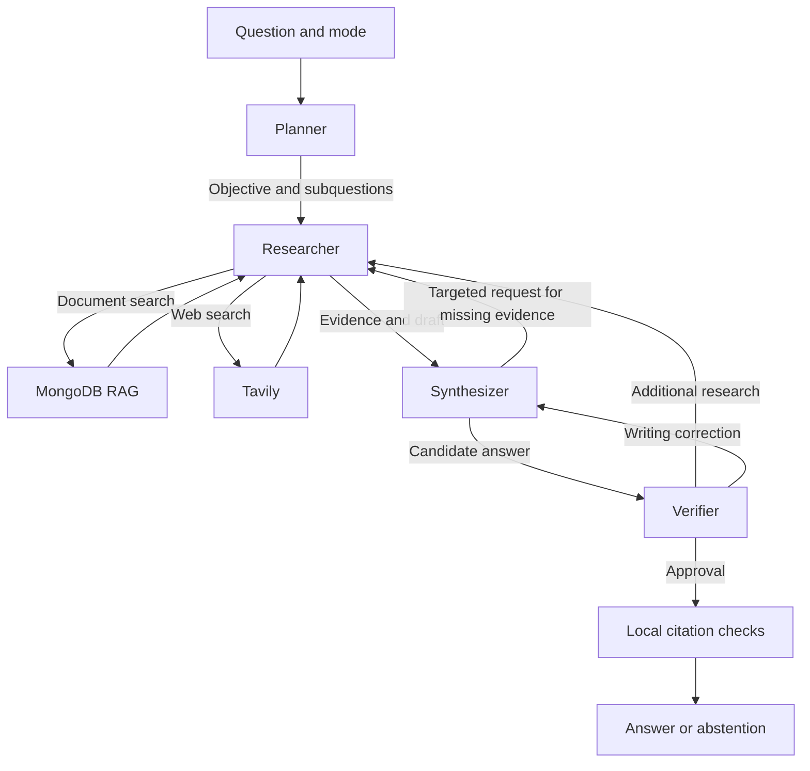

# Four collaborating documentary agents with Hugging Face

The default `multi_agent` chat strategy uses structured exchanges and **at most one correction attempt**. RAG remains the researcher's document capability; Tavily adds public web evidence.

## Agents and responsibilities

| Agent | Class | Decision and handoff |
|---|---|---|
| Planner | `PlanningAgent` | Defines an objective and one to four subquestions; sends the plan to the researcher |
| Researcher | `DocumentaryAgent` | Chooses searches and reads; provides evidence and a draft, requests clarification or abstains |
| Synthesizer | `SynthesisAgent` | Writes a cited answer; can request a targeted search when evidence is missing |
| Verifier | `VerificationAgent` | Approves, rejects, requests additional research or requests a writing correction |

The specialists share the configured Hugging Face service with distinct prompts. Multiple agents do not require multiple models. The current planner is `PlanningAgent`, not the historical `LLMPlannerAgent` retained for experiments.

`DocumentaryTeam.graph` is a compiled LangGraph subgraph with four nodes: `planner`, `researcher`, `synthesizer`, `verifier`. Conditional branches follow structured agent decisions. The HTTP graph runs this subgraph inside `documentary` and also retains direct-answer, validation and finalization paths.

## How collaboration works

The planner sends an objective and subquestions. The researcher receives the plan and any correction request in its observations. Retrieved numbered excerpts become evidence for synthesis and verification.

The synthesizer may return `answerable=false`, `next_step=research` and a specific `request`. The verifier may return `approved=false` with `research`, `revise` or `reject`. For an approved answer, `next_step=reject` means no correction is executed: `approved` takes precedence. This convention preserves the previous response contract.

The first return consumes the only correction attempt, regardless of which agent requested it. Additional research restarts the researcher with the selected evidence and targeted request. It may search or reread a discovered fragment. Citation labels are rebuilt for the new context and the next synthesis must use those current labels. A writing correction reuses evidence without rerunning retrieval tools.

A second correction request, invalid decision or provider failure prevents publication. There is no unrestricted agent conversation, arbitrary delegation or infinite loop. The researcher may decide that another search is unnecessary; its choice remains visible in diagnostics.

## Budgets

| Limit | Value |
|---|---:|
| Planning | 1 LLM call |
| One research pass | At most 2 searches, 3 tools and 4 LLM calls |
| Synthesis | 1 call per pass |
| Verification | 1 call per pass |
| Team-wide correction attempts | 1 |
| Overall maximum | 13 LLM calls, 4 searches, 6 tools |
| Overall team duration | 90 seconds by default |

One search without correction normally uses five calls: plan, search decision, research draft, synthesis and verification. A complete initial pass can use seven. The maximum of thirteen covers planning and two complete research/synthesis/verification passes. Failed attempts count. Embeddings are separate from the LLM counter.

`DOCUMENTARY_AGENT_TIMEOUT_SECONDS` sets the global duration, greater than zero and at most 300 seconds. A correction does not reset it. A PyMongo operation already running in a thread may finish after cancellation of the wait, but generation cannot resume after the deadline.

## Document search and permissions

`rechercher(query)` uses parallel Atlas text/vector search, RRF fusion, reranking and compression. `lire_passage(passage_id)` rereads an already discovered MongoDB fragment using current permissions. Guessed IDs are refused. A fragment that becomes inaccessible causes abstention.

The server supplies permissions. Agent decisions cannot set `owner_id`, shell commands or MongoDB filters. Evidence, plans, requests and counters are isolated per request, including concurrent requests. Existing tool identifiers remain stable for API compatibility.

## Web search with Tavily

Set `TAVILY_API_KEY` on the backend. In `auto` mode, the researcher may use `rechercher_web(query)` for public information. `documents` blocks this tool; `general` retains its no-retrieval path. The model never receives the API key. Hugging Face remains the generation provider.

The service uses the [official Tavily Search API](https://docs.tavily.com/documentation/api-reference/endpoint/search), at most five results, `basic` depth, no generated answer and no raw page content. MongoDB and Tavily share the search budgets.

Web results include a `web:` ID, an explicit type, excerpt and HTTP(S) URL. They are neither ingested into MongoDB nor read through the MongoDB passage tool. Only the chosen query is sent to Tavily: the service does not append history, passages or user identity. The prompt forbids private data in that query, but a prompt alone cannot guarantee that a model will never include it.

## Publication and learning traces

LLM verification does not replace local checks. An approved answer with invalid citations still causes abstention. Citation validation checks presence and range with an optional lexical signal; it does not prove semantic truth. `critic_score=null` and `factuality_evaluated=false` remain explicit.

`evaluation.collaboration` is a chronological list of sender, recipient, message, subquestions and evidence references. The frontend shows these under **Agent collaboration**, after the response, alongside overall budgets and the correction count. These are work messages, not hidden model reasoning. They are not streamed live.

`evaluation.documentary_agent` describes the latest research pass; `evaluation.documentary_team` contains team totals. `evaluation.answer.status` distinguishes `answered`, `clarification_requested` and `abstained`. Diagnostic drafts may contain errors; only the final answer is the published response.

## Reference strategies and evaluation

`strategy="baseline"` retains the simple workflow with at most one generation call. `strategy="agent"` retains the researcher alone. `strategy="multi_agent"` enables the four-role team. The comparator compares the baseline to the current team; its output label `agent` refers to that team.

Local tests cover plan transmission, additional research, writing correction, synthesizer requests, refusal of a second return, the thirteen-call ceiling, permissions, failures, timeout and concurrent isolation. They do not establish business-answer quality. Measure gains, costs and unjustified refusals against independently annotated questions.

Technical retrieval components remain under `agents/`. Historical planner, CRAG and critic classes remain in `evaluation/experimental/` and are not automatically reactivated. This change adds neither OCR nor a corpus migration.

## Parallel retrieval

Text and vector searches run concurrently with the same query and access scope, then fuse through RRF. The benchmark uses the same path. Metrics report branch durations, combined parallel duration and partial failures. See [RAG_SYSTEM.md](RAG_SYSTEM.md). Tests cover concurrent start, equivalent fusion, failures, cancellation and user isolation.
