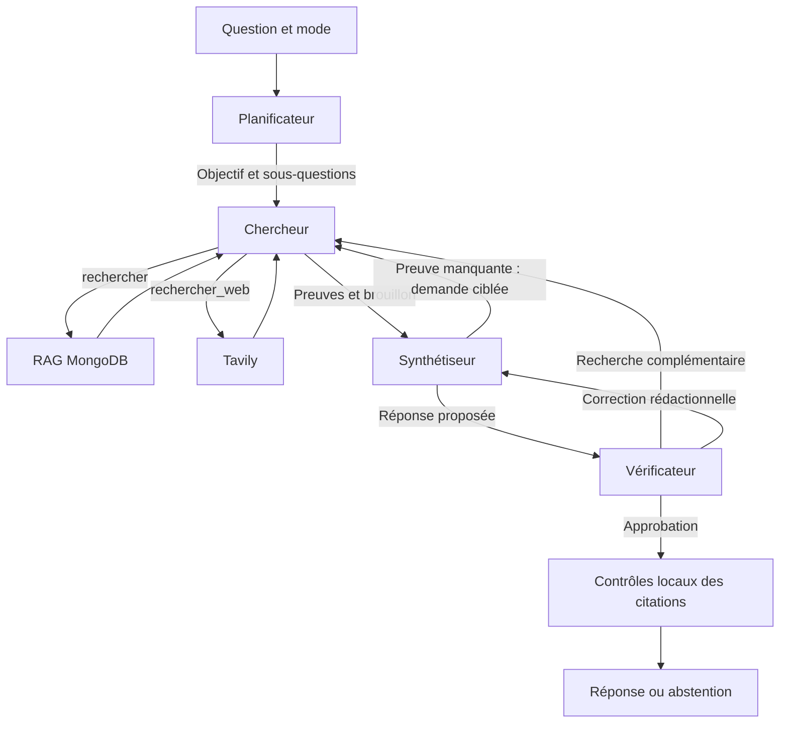

# Quatre agents qui collaborent avec Hugging Face

Le parcours `multi_agent`, utilisé par défaut dans le chat, est une équipe avec échanges structurés et **un retour de correction maximum**. Le RAG reste la capacité documentaire du chercheur ; Tavily ajoute les sources publiques du web.

## Agents et responsabilités

| Agent | Classe | Décision et transmission |
|---|---|---|
| Planificateur | `PlanningAgent` | Définit un objectif et une à quatre sous-questions ; transmet le plan au chercheur |
| Chercheur | `DocumentaryAgent` | Choisit les recherches et lectures ; transmet preuves et brouillon, demande une précision ou s’abstient |
| Synthétiseur | `SynthesisAgent` | Rédige avec citations ; peut demander une recherche ciblée si une preuve manque |
| Vérificateur | `VerificationAgent` | Approuve, refuse, demande une recherche complémentaire ou une correction rédactionnelle |

Les spécialistes partagent le service Hugging Face configuré, avec des prompts distincts. Plusieurs agents ne nécessitent pas plusieurs modèles. Le planificateur actuel est `PlanningAgent`, pas l’ancien `LLMPlannerAgent` conservé dans les expériences.

Un sous-graphe LangGraph compilé dans `DocumentaryTeam.graph` expose quatre nœuds : `planner`, `researcher`, `synthesizer`, `verifier`. Les branches suivent les décisions structurées des agents. Ce sous-graphe est exécuté dans le nœud `documentary` du graphe HTTP, qui conserve aussi les chemins directs, la validation et la finalisation.

## Comment les agents collaborent

Le planificateur transmet un objectif et des sous-questions. Le chercheur reçoit ce plan dans ses observations, ainsi que toute demande de correction. Ses résultats fournissent des extraits numérotés au synthétiseur et au vérificateur.

Le synthétiseur peut retourner `answerable=false`, `next_step=research` et une demande précise. Le vérificateur peut retourner `approved=false` et choisir `research`, `revise` ou `reject`. Pour une approbation, `next_step=reject` signifie qu’aucun retour n’est exécuté : le booléen `approved` est prioritaire. Cette convention conserve la compatibilité du contrat précédent.

Le premier retour consomme l’unique correction autorisée, quel que soit l’agent demandeur. Une demande de recherche relance le chercheur avec les preuves déjà sélectionnées et la demande ciblée. Il peut rechercher ou relire un fragment découvert. Les citations sont renumérotées selon le nouveau contexte ; la synthèse suivante doit employer ces labels courants. Une correction rédactionnelle réutilise les preuves sans relancer les outils.

Un deuxième retour, une décision invalide ou une panne empêche la publication. Il n’existe pas de conversation libre entre agents, de délégation arbitraire ni de boucle infinie. Le chercheur peut décider qu’aucune recherche supplémentaire n’est nécessaire ; sa décision demeure visible dans les traces.

## Budgets

| Limite | Valeur |
|---|---:|
| Planification | 1 appel LLM |
| Une passe du chercheur | 2 recherches, 3 outils et 4 appels LLM maximum |
| Synthèse | 1 appel par passage |
| Vérification | 1 appel par passage |
| Retours de correction | 1 pour toute l’équipe |
| Total maximal | 13 appels LLM, 4 recherches, 6 outils |
| Durée de l’équipe entière | 90 secondes par défaut |

Un parcours sans correction et avec une seule recherche consomme normalement cinq appels : plan, décision de recherche, brouillon, synthèse et vérification. Une première passe complète peut en consommer sept. Le maximum de treize correspond au plan et à deux passes complètes de recherche/synthèse/vérification. Les tentatives échouées sont comptées. Les embeddings sont des appels distincts du compteur LLM.

`DOCUMENTARY_AGENT_TIMEOUT_SECONDS` règle le délai global, strictement positif et au plus 300 secondes. La correction ne réinitialise pas ce délai. Une lecture PyMongo déjà démarrée dans un thread peut terminer après annulation de l’attente ; elle ne permet pas de reprendre la génération.

## Recherche documentaire et permissions

`rechercher(query)` utilise Atlas Search, recherche vectorielle, fusion RRF, reranking et compression. `lire_passage(passage_id)` relit un fragment MongoDB déjà découvert avec les permissions actuelles. Un ID deviné est refusé. Un fragment devenu inaccessible entraîne l’abstention.

Les permissions viennent du serveur. Les décisions des agents ne peuvent pas fournir `owner_id`, une commande shell ou un filtre MongoDB. Le registre des preuves, le plan, les demandes et les compteurs sont propres à chaque requête, y compris lors de requêtes concurrentes.

## Recherche internet avec Tavily

Configurer `TAVILY_API_KEY` côté backend. En mode `auto`, le chercheur peut utiliser `rechercher_web(query)` pour des informations publiques. Le mode `documents` bloque cet outil ; `general` conserve son parcours sans recherche. La clé n’est jamais fournie au modèle. Hugging Face reste le fournisseur de génération.

L’outil utilise l’[API Search officielle de Tavily](https://docs.tavily.com/documentation/api-reference/endpoint/search), avec cinq résultats maximum, profondeur `basic`, sans génération de réponse ni récupération de contenu brut. Les recherches MongoDB et Tavily partagent les budgets.

Les résultats web portent un ID `web:`, un type explicite, un extrait et une URL HTTP(S). Ils ne sont pas ingérés dans MongoDB et ne sont pas relus via l’outil MongoDB. Seule la requête choisie est envoyée à Tavily : le service n’ajoute ni historique, ni passages, ni identifiant utilisateur. Le prompt interdit les données privées dans cette requête, sans garantir à lui seul qu’un modèle ne les y insérera jamais.

## Publication et traces pédagogiques

Le vérificateur ne remplace pas les contrôles locaux. Une approbation avec citations invalides conduit toujours à l’abstention. Le contrôle des citations vérifie présence et plage, avec un signal lexical optionnel ; il ne prouve pas la vérité sémantique. `critic_score=null` et `factuality_evaluated=false` restent explicites.

`evaluation.collaboration` expose une liste chronologique : émetteur, destinataire, message, sous-questions ou références des preuves transmises. Le frontend affiche ces échanges après la réponse dans « Collaboration des agents », avec les budgets globaux et la correction utilisée. Il s’agit de messages de travail, pas du raisonnement interne des modèles. L’affichage n’est pas une diffusion en temps réel.

`evaluation.documentary_agent` décrit la dernière passe du chercheur ; `evaluation.documentary_team` contient les totaux de l’équipe. `evaluation.answer.status` distingue réponse, précision et abstention. Les brouillons de diagnostic peuvent contenir des erreurs ; seule la réponse finale est destinée à répondre à l’utilisateur.

## Références et évaluation

`strategy="baseline"` conserve le workflow simple avec au plus une génération. `strategy="agent"` conserve le chercheur seul. `strategy="multi_agent"` active la collaboration à quatre rôles. Le comparateur existant compare la baseline à l’équipe courante ; l’étiquette de sortie `agent` désigne l’équipe.

Les tests locaux couvrent transmission du plan, recherche complémentaire, correction de synthèse, demandes du synthétiseur, refus d’un second retour, total maximal de treize appels, permissions, erreurs, timeout et isolation concurrente. Ils ne prouvent pas que la collaboration améliore la qualité métier. Le gain, le coût et les refus injustifiés doivent être mesurés sur le même corpus de questions annotées.

Les composants de recherche techniques restent dans `agents/`. Les anciens planner, CRAG et critic LLM restent dans `evaluation/experimental/` ; ils ne sont pas réactivés automatiquement. Pas d’OCR ajouté ni de migration du corpus dans cette évolution.
