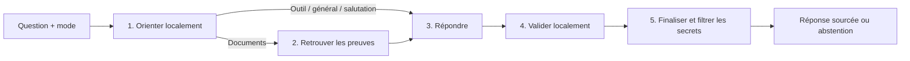

# Architecture simplifiée — décisions du 10 septembre 2026

> Cette architecture est désormais la baseline d’évaluation. Le parcours HTTP courant est décrit dans [ARCHITECTURE_AGENT.md](ARCHITECTURE_AGENT.md).

## Avis d'architecture

Le besoin pertinent est un **assistant documentaire avec preuves**, pas une équipe autonome d'agents généralistes. Une bonne démonstration IA montre que le système retrouve les passages utiles, cite correctement, refuse les réponses non vérifiables et rend ses limites observables. Le nombre d'agents ne mesure aucune de ces qualités.

Le parcours précédent avait 21 nœuds LangGraph : planification LLM, conversion du plan en route, recherche, fusion, reranking, CRAG, compression, génération, citations, critic, sécurité et plusieurs nœuds de reprise ou de contournement. Une question documentaire pouvait faire quatre appels LLM au parcours nominal : planner, CRAG, génération, critic, plus les embeddings. Des reprises pouvaient s'ajouter. Chaque décision intermédiaire créait de nouveaux cas de panne et des états à synchroniser.

Le choix réalisé est un workflow borné à cinq étapes. Cette distinction entre workflow prévisible et agent autonome, ainsi que l'ajout de complexité uniquement après mesure d'un gain, rejoint les recommandations d'[Anthropic sur les agents efficaces](https://www.anthropic.com/engineering/building-effective-agents). C'est ici une décision adaptée au besoin documentaire ; ce n'est pas une preuve expérimentale de meilleure qualité sémantique.

## Architecture réellement implémentée

| Étape | Responsabilité | Appel LLM de génération |
|---|---|---:|
| Orienter | Respecter le mode demandé, reconnaître salutation/calcul/inventaire, privilégier le documentaire en mode automatique | 0 |
| Retrouver | Atlas Search + Vector Search, fusion RRF, reranking optionnellement sémantique, compression locale | 0 ; appels embeddings distincts |
| Répondre | Un outil déterministe, une réponse générale explicite, ou une génération fondée sur les passages sélectionnés | 0 ou 1 |
| Valider | Réponse présente, outil réussi, preuves présentes pour le RAG, citations valides | 0 |
| Finaliser | Publier le brouillon validé ou s'abstenir ; filtrer localement les secrets du texte final | 0 |

La lecture/écriture de conversation reste dans Redis. LangGraph représente le parcours, sans checkpoint parallèle ni boucle. Une seule classe `RetrievalPipeline` câble la recherche pour le chat et le benchmark. Les traces détaillées des composants restent accessibles, sans faire de chacun un nœud du graphe.

## Changements appliqués

- **Planification locale** : `workflows/routing.py` remplace planner LLM + ToolRouter. Les résumés de documents restent documentaires ; une date ou une opération dans une phrase ne suffit plus à déclencher la calculatrice.
- **Choix explicite du périmètre** : `ChatRequest.mode` accepte `auto`, `documents` ou `general`, avec un sélecteur dans l'interface. Le défaut reste `auto`, compatible avec les anciens clients. Le mode général ne promet aucune source documentaire.
- **Aucune boucle en ligne** : suppression des chemins CRAG et des retries de génération. Les anciens planner, CRAG et critic LLM sont déplacés dans `evaluation/experimental/` pour une comparaison hors ligne, sans import par le workflow HTTP.
- **Validation honnête** : `critic_score=null` ; `evaluation.critic.source=local` et `factuality_evaluated=false`. Le champ historique `critic_passed` signifie « contrôles de contrat réussis », pas « réponse certainement vraie ».
- **Abstention effective** : après échec du contrôle des citations, le brouillon n'est plus publié avec une simple note de validation. L'absence de preuves et la panne du fournisseur ont des messages explicites. `evaluation.answer` indique `answered` ou `abstained` et le motif.
- **Mémoire simplifiée** : un seul chargement du contexte, avant l'ajout de la question courante. Celle-ci n'est plus dupliquée dans l'historique envoyé au modèle. Isolation par propriétaire conservée.
- **Ingestion indépendante du cache** : les routes d’ingestion ne sollicitent plus Redis pour invalider un cache de réponses supprimé. Une écriture MongoDB réussie ne devient plus un échec à cause de cette opération Redis inutile.
- **Configuration de génération** : suppression du catalogue statique prétendant lister des modèles disponibles. Une valeur `HUGGINGFACE_MODEL` suffit au fonctionnement général ; les surcharges `MODEL_*` existantes sont conservées. `LLM_PROVIDER=ollama` construit réellement un client local et emploie `OLLAMA_MODEL`.
- **Budget prévisible** : au plus un appel de génération au niveau applicatif par tour ; retries automatiques du client désactivés. Un incident fournisseur entraîne une réponse d'indisponibilité, pas une série de tentatives opaques.
- **Évaluation alignée** : un cas peut attendre une abstention. L'évaluateur ne confond plus une abstention correcte avec l'échec à produire une réponse alors qu'une réponse était attendue.

Le branchement Ollama utilise l'interface `/v1` documentée par le [projet Ollama](https://docs.ollama.com/api/openai-compatibility). Les embeddings restent actuellement calculés via HuggingFace, même si la génération est locale.

## Compatibilité et configuration

Les routes HTTP, le format `ChatResponse`, les métadonnées documentaires et le stockage sont conservés. `mode` est un champ facultatif supplémentaire. `agents_used`, `plan` et les noms des étapes reflètent désormais le nouveau parcours : les consommateurs ne doivent pas dépendre de l'ancienne liste d'agents.

Les options `CORRECTIVE_RAG_ENABLED`, `CORRECTIVE_RAG_MIN_RELEVANCE`, `CRITIC_ENABLED`, `CRITIC_ROUTES`, `SAFETY_ENABLED`, `LANGGRAPH_CHECKPOINT_ENABLED` et `LANGGRAPH_CHECKPOINT_BACKEND` ne pilotent plus le runtime. Elles sont retirées du schéma et du fichier d'exemple. Les anciennes valeurs d'un `.env` ne réactivent pas l'ancien graphe. La validation locale et le filtre de sortie sont toujours exécutés.

L'argument Python interne `cache_service` de `ChatWorkflow` est supprimé : le cache de réponses avait déjà été retiré lors de l'audit précédent. Aucun changement de collection MongoDB, aucune réingestion et aucun déploiement n'ont été effectués pour cette simplification.

## Ce que l'on peut affirmer — et ce qu'il faut encore mesurer

La réduction des nœuds, des appels de génération et des branches est vérifiée par le code et des tests de parcours. Le nouveau graphe est acyclique. Les tests vérifient aussi qu'aucun planner, grader CRAG ou critic LLM n'est appelé en ligne.

Cela ne démontre pas une meilleure réponse sur tous les documents. Retirer les étapes LLM peut supprimer une correction utile sur certains cas difficiles ; le nouveau système privilégie alors la prévisibilité et l'abstention. Le routage local peut manquer une intention implicite : le mode explicite permet de la préciser.

Le contrôle des citations est structurel avec un signal lexical optionnel. Une citation existante peut néanmoins accompagner une affirmation fausse. L'évaluation sémantique doit utiliser un jeu de référence métier séparé, avec relecture humaine et, éventuellement, un juge indépendant hors ligne. La nouvelle abstention ne détecte pas toutes les réponses incorrectes.

## Prochaines améliorations qui ont une valeur démontrable

1. **Corpus fiable** : OCR si les PDF sont scannés, découpage adapté au tokenizer, provenance de modèle des vecteurs, remplacement des versions de fichiers. Un meilleur graphe ne retrouve pas une preuve perdue à l'ingestion.
2. **Jeu de référence** : questions métier en français, pages attendues, citations attendues, cas sans réponse, questions conversationnelles et droits d'accès. Inclure explicitement des paraphrases qui ne partagent pas les mots du document.
3. **Comparaison contrôlée** : mesurer réponse correcte, qualité des citations, taux d'abstention juste/abusif, Recall@k, latence et coût sur le parcours simple. Puis comparer séparément reranker, CRAG ou reformulation, avec les composants expérimentaux.
4. **Exploitation** : jobs d'ingestion persistants, état réel des index et métriques de dégradation. Extraire ensuite les grands composants React du cockpit si son évolution le nécessite.

Réintroduire une décision LLM seulement si elle corrige une catégorie d'échecs identifiée, améliore les résultats sur un jeu de test non utilisé pour le réglage et respecte un budget d'appels explicite. Le but est une architecture facile à expliquer et à évaluer, pas de maximiser le nombre d'agents.

## Vérification de cette révision

- 72 tests backend réussis, sans appels aux fournisseurs.
- Build frontend et vérification TypeScript réussis.
- Compilation Python et `git diff --check` sans erreur.
- Budget vérifié par tests : zéro génération pour salutation/calcul/inventaire/absence de preuves ; une génération pour RAG ou réponse générale, sans planner, CRAG ou critic LLM.
- Vérification sémantique sur des fournisseurs réels non effectuée pendant cette simplification ; aucun résultat de qualité en production n'est déduit de ces tests.
