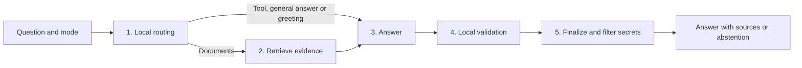

# Simplified architecture — September 10, 2026 decisions

> Historical baseline document. The current collaborative HTTP workflow is described in [ARCHITECTURE_AGENT.md](ARCHITECTURE_AGENT.md). The rationale below records the earlier simplification, not the current learning objective of building collaborating agents.

## Architecture assessment at that revision

The simplification prioritized a documentary assistant with evidence: useful passage retrieval, correct citation structure, refusal of unverifiable answers and observable limitations. Agent count alone measures none of these qualities.

The preceding workflow had 21 LangGraph nodes: LLM planning, plan-to-route conversion, retrieval, fusion, reranking, CRAG, compression, generation, citations, criticism, safety and retry/skip nodes. A normal documentary question could make four LLM calls (planner, CRAG, generation and critic), plus embeddings and possible retries. Each intermediate decision created more failure cases and state synchronization work.

The implemented baseline has five stages. Its distinction between predictable workflows and autonomous agents, and adding complexity only after measuring a gain, follows the approach discussed in [Anthropic's effective-agent guidance](https://www.anthropic.com/engineering/building-effective-agents). This was a design judgment for the documentary task, not experimental proof of better semantic quality.

## Implemented baseline

| Stage | Responsibility | Generation calls |
|---|---|---:|
| Route | Honor mode, recognize greetings/calculations/inventory, prefer documents in automatic mode | 0 |
| Retrieve | Atlas Search + Vector Search, RRF, optional semantic reranking, local compression | 0; embeddings are separate |
| Answer | Deterministic tool, explicit general answer or generation from selected passages | 0 or 1 |
| Validate | Nonempty answer, successful tools, RAG evidence and valid citations | 0 |
| Finalize | Publish the validated draft or abstain, then filter secrets | 0 |

Redis retains conversation history. The baseline graph has no parallel checkpoint or correction loop. Shared `RetrievalPipeline` wiring serves chat and evaluation; detailed component traces remain available without making every component an outer graph node.

## Changes made in that revision

- **Local planning:** `workflows/routing.py` replaced the LLM planner and tool router. Document summaries remain documentary; a date or embedded arithmetic expression alone no longer selects the calculator.
- **Explicit scope:** `ChatRequest.mode` accepts `auto`, `documents` and `general`, with `auto` remaining compatible with older clients. General mode does not promise document sources.
- **No online baseline loop:** CRAG and generation retries were removed. Historical planner, CRAG and LLM-critic components moved to `evaluation/experimental/` without HTTP workflow imports.
- **Honest validation:** `critic_score=null`, `evaluation.critic.source=local` and `factuality_evaluated=false`. `critic_passed` means the local contract passed, not that the answer is certainly true.
- **Effective abstention:** invalid citations prevent draft publication instead of merely adding a validation note. Missing evidence and provider outages have explicit messages; `evaluation.answer` exposes status and reason.
- **Simpler history:** load context before appending the current question to avoid duplicating it in the model input. Owner isolation remains intact.
- **Cache-independent ingestion:** ingestion stopped touching Redis to invalidate the already removed response cache, so an unnecessary Redis failure cannot turn a successful MongoDB write into an ingestion error.
- **Generation configuration:** removed the static model catalog that implied availability. `HUGGINGFACE_MODEL` supplies a default; existing `MODEL_*` overrides remain. Optional `LLM_PROVIDER=ollama` creates a local client using `OLLAMA_MODEL`.
- **Predictable baseline budget:** at most one application-level generation call per turn, with client retries disabled. A provider incident produces an unavailable response instead of hidden repeated attempts.
- **Aligned evaluation:** cases can expect abstention, and correct abstention is no longer confused with failing to produce an expected answer.

The optional Ollama client uses its documented [OpenAI-compatible interface](https://docs.ollama.com/api/openai-compatibility). Embeddings remain Hugging Face calls even when generation is local. The current project choice is Hugging Face.

## Compatibility and configuration

HTTP routes, `ChatResponse`, document metadata and storage were retained. `mode` is an optional added field. `agents_used`, `plan` and stage names reflect the chosen strategy; clients must not assume the historical agent list.

`CORRECTIVE_RAG_ENABLED`, `CORRECTIVE_RAG_MIN_RELEVANCE`, `CRITIC_ENABLED`, `CRITIC_ROUTES`, `SAFETY_ENABLED`, `LANGGRAPH_CHECKPOINT_ENABLED` and `LANGGRAPH_CHECKPOINT_BACKEND` no longer control the current runtime. They were removed from the settings schema and example file. Stale `.env` entries do not reactivate the old graph. Local validation and output filtering always run.

The internal `cache_service` constructor argument was removed because the earlier audit had already removed answer caching. No MongoDB collection change, reingestion or deployment was performed for this simplification.

## Verified claims and remaining measurements

Code and workflow tests verify fewer baseline nodes, generation calls and branches. The baseline is acyclic and does not call the experimental planner, CRAG grader or LLM critic.

This does not prove better answers on every document. Removing LLM stages can remove useful corrections on difficult cases; the baseline prioritizes predictability and abstention. Local routing can miss implicit intent, which explicit modes help disambiguate.

Citation checks are structural with optional lexical support. A valid citation can still accompany a false claim. Semantic evaluation requires separate business ground truth, independent review and optionally an offline judge. Abstention does not detect every incorrect answer.

## Improvements to evaluate

1. **Reliable corpus:** OCR where needed, tokenizer-aware chunking, embedding provenance and file-version replacement. A better graph cannot recover evidence lost during ingestion.
2. **Ground truth:** representative questions, expected pages/citations, unanswerable cases, conversational references, access scope and paraphrases without shared document words.
3. **Controlled comparison:** answer correctness, citation support, appropriate/excessive abstention, Recall@k, latency and cost; compare reranking, CRAG or rewriting separately.
4. **Operations:** persistent ingestion jobs, real index readiness, degraded-mode metrics and eventual extraction of large frontend components.

Additional LLM decisions should address observed failure categories, improve held-out results and respect explicit budgets. The current collaborative team also serves the user's learning objective, as documented in the current architecture reference.

## Verification recorded for this revision

- 72 backend tests passed without provider calls.
- Frontend build and TypeScript checks passed.
- Python compilation and `git diff --check` passed.
- Tests verified zero generation calls for greeting/calculation/inventory/missing evidence and at most one for baseline RAG/general answers.
- No provider-backed semantic quality evaluation was completed during this simplification; these results do not establish production answer quality.
