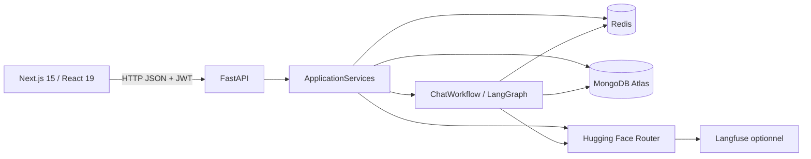
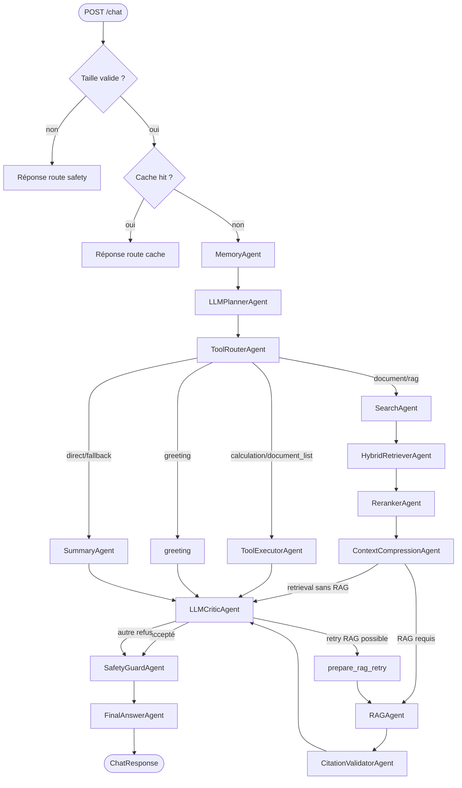

# Guide du projet — Agentic RAG Platform

> Référence d'architecture vérifiée contre le code de la branche
> `feature/async-io-performance-fix` le **18 août 2026**.

## 1. Objectif et périmètre

Agentic RAG Platform est une application de chat qui choisit entre une réponse
directe et une réponse fondée sur des documents. Le backend orchestre des agents
spécialisés avec LangGraph, expose le chemin suivi dans sa réponse JSON et le
frontend affiche ces informations dans un cockpit de debug.

Le projet démontre notamment :

- une orchestration conditionnelle réelle, pas une simple liste d'appels ;
- un retrieval hybride MongoDB Atlas Search + Atlas Vector Search ;
- des sorties LLM structurées et validées par Pydantic pour le planner et le
  critic ;
- plusieurs modes dégradés quand Redis, MongoDB, les embeddings ou le LLM sont
  indisponibles ;
- une interface qui rend route, agents, métriques et sorties brutes visibles.

Il s'agit d'un starter avancé et pédagogique. Les garde-fous et l'évaluation ne
suffisent pas encore à qualifier le système de plateforme d'entreprise.

## 2. Architecture générale



### Cycle de vie du backend

`backend/app/main.py` utilise le lifespan FastAPI pour créer un
`ApplicationServices` par processus worker. Ce conteneur construit et partage :

- un `RedisMemoryService` ;
- un `SearchService` et son client PyMongo ;
- un `HuggingFaceEmbeddingService` ;
- un `LLMService` avec un client `AsyncOpenAI` ;
- un `AuthService` ;
- un `ChatWorkflow`, dont le graphe est compilé une seule fois.

À l'arrêt, le pool Redis, le client MongoDB et le client LLM sont fermés. Cette
organisation remplace l'ancienne création de services au niveau des routers.

### I/O et concurrence

- LLM : client `AsyncOpenAI`, appels réellement asynchrones.
- Redis : client `redis.asyncio` pour les opérations courantes.
- MongoDB : PyMongo reste synchrone, mais `aggregate`, `insert_many` et
  `delete_many` sont exécutés via `asyncio.to_thread`.
- Upload : la copie du fichier est déportée via `asyncio.to_thread`.
- Parsing PDF/CSV : exécuté localement et synchroniquement après la copie ; un
  fichier très volumineux peut donc encore occuper le worker.
- Au démarrage, les pings Redis et MongoDB sont synchrones, avant le service des
  requêtes.

## 3. Organisation du dépôt

```text
backend/app/main.py                 création FastAPI, lifespan, middlewares
backend/app/service_container.py    ressources partagées du processus
backend/app/routers/                health, auth, chat, ingestion, reset
backend/app/workflows/              graphe LangGraph principal
backend/app/agents/                 agents et fallbacks spécialisés
backend/app/state/                  GraphState dataclass + TypedDict LangGraph
backend/app/services/               LLM, embeddings, MongoDB, auth, JWT
backend/app/memory/                 Redis + fallback mémoire locale
backend/app/data_ingest/            lecture PDF/CSV
backend/app/prompts/                prompts centralisés
backend/app/evaluation/             évaluateur chat + benchmark retrieval
backend/app/middleware/             logs HTTP, rate limit, headers de sécurité
backend/tests/                      tests unitaires backend
frontend/app/page.tsx               UI, appels API et cockpit
frontend/app/globals.css            thèmes et styles globaux
docs/                               documentation technique
```

## 4. Stack réelle

| Domaine | Technologie | Usage réel |
|---|---|---|
| API | FastAPI, Uvicorn, Pydantic | Routes HTTP et validation |
| Orchestration | LangGraph `StateGraph` | Graphe conditionnel de 17 nœuds |
| Outils | Calculatrice, inventaire, validateur de citations | Exécution locale/contrôlée |
| LLM | Hugging Face Router via `AsyncOpenAI` | Planning, réponse directe, RAG, critic |
| Embeddings | Hugging Face `feature-extraction` via `httpx` | Ingestion, vector search, reranking |
| Données documentaires | MongoDB Atlas | Collection unique, Search + Vector Search |
| Mémoire/cache/comptes | Redis | Listes de messages et valeurs clé/valeur |
| Auth | PyJWT, Passlib PBKDF2-SHA256 | JWT et hash des mots de passe |
| Observabilité | Loguru, Langfuse optionnel | Logs structurés et traces LLM |
| Frontend | Next.js 15, React 19, TypeScript | Auth, chat, ingestion, debug |
| Fichiers | PyPDF2, `csv` standard | Une page PDF ou une ligne CSV par document |

Important : `Settings.llm_provider` accepte `ollama` ou `huggingface`, mais
`LLMService` ne contient actuellement qu'une implémentation Hugging Face. Les
champs `OLLAMA_BASE_URL` et `OLLAMA_MODEL` ne sont pas consommés.

## 5. API HTTP

Le préfixe par défaut est `/api/v1`.

| Méthode et route | Auth | Fonction |
|---|---:|---|
| `GET /health` | non | État du backend, Redis et MongoDB + provider configuré |
| `POST /api/v1/auth/register` | non | Crée un compte Redis, mot de passe hashé |
| `POST /api/v1/auth/login` | non | Retourne un JWT |
| `GET /api/v1/auth/me` | oui | Valide le JWT et l'existence du compte |
| `POST /api/v1/chat` | oui | Exécute cache ou workflow LangGraph |
| `GET /api/v1/conversations/{id}/context` | oui | Lit l'historique Redis |
| `DELETE /api/v1/conversations/{id}/context` | oui | Efface cet historique |
| `POST /api/v1/ingest/sample-data` | oui | Indexe `ai_tooling_catalog.csv` |
| `POST /api/v1/ingest/upload` | oui | Sauvegarde et indexe un PDF/CSV |
| `POST /api/v1/ingest/batch` | oui | Indexe les PDF/CSV d'un dossier serveur |
| `DELETE /api/v1/data/reset` | oui | Vide documents, conversations et cache |

`/health` ne réalise pas d'appel test au LLM. `llm_provider` décrit la
configuration, pas la disponibilité, le quota ou la validité de la clé.

### Contrat du chat

Requête :

```json
{
  "message": "Résume le document indexé",
  "conversation_id": null,
  "history": [{"role": "assistant", "content": "..."}]
}
```

La réponse contient : `conversation_id`, `route`, `answer`, `agents_used`,
`agent_results`, `tool_results`, `cached`, `context_messages`, `plan`, les champs critic et
safety, `retrieval_metrics`, `evaluation` et `trace_id`.

## 6. Workflow de chat

Avant LangGraph, `ChatWorkflow.run()` :

1. choisit ou crée le `conversation_id` ;
2. lit le contexte Redis ;
3. refuse les messages au-delà de `MAX_USER_MESSAGE_CHARS` ;
4. consulte le cache ;
5. sur cache miss, ajoute le message utilisateur à la mémoire ;
6. exécute le graphe ;
7. ajoute la réponse assistant et la met en cache.



Le graphe contient 17 nœuds : 14 associés à une classe d'agent et 3 nœuds
techniques (`greeting`, `prepare_rag_retry`, `prepare_summary_retry`). Voir
[AGENTS.md](AGENTS.md) pour le détail.

### Nuances importantes du routage

- Les champs `requires_critic` et `requires_safety` du `PlannerDecision` sont
  informatifs : le graphe exécute actuellement critic et safety dans tous les
  chemins non mis en cache.
- Une route `document_qa` avec `requires_rag=False` fait tout de même search,
  hybrid retrieval, reranking et compression, puis va directement au critic.
- Le retry RAG fonctionne pour `route="rag"` avec documents présents.
- Une réponse directe refusée peut maintenant passer une fois par
  `prepare_summary_retry`; le second verdict va au safety pour borner la boucle.
- Les routes `calculation` et `document_list` exécutent uniquement un outil
  autorisé, puis passent par critic, safety et finalisation.

## 7. État partagé et observabilité du graphe

`GraphState` est la dataclass manipulée par les agents. `GraphStateDict` est le
schéma `TypedDict` utilisé par LangGraph. Les conversions ont lieu à chaque
frontière de nœud.

Les groupes de champs principaux sont :

- identité : `conversation_id`, `transaction_id`, `user_message` ;
- contexte : `history`, `conversation_context` ;
- décision : `intent`, `route`, `plan`, `tools`, `planner_decision` ;
- outils : `tool_results` ;
- retrieval : `search_results`, `reranked_results`, `compressed_context` ;
- génération : `search_output`, `summary_output`, `rag_output`, `draft_answer` ;
- contrôle : critic, safety, `correction_attempted` ;
- sortie/debug : `final_answer`, `agents_used`, `agent_results`,
  `retrieval_metrics`, `evaluation`, `metadata`, `error`.

Chaque wrapper de nœud mesure sa latence dans
`evaluation.latency_ms[NodeName]`. `record_result()` ajoute la sortie brute et
évite les doublons dans `agents_used`, ce qui signifie qu'un agent réexécuté
pendant un retry n'apparaît qu'une fois dans cette liste.

### Outils déterministes

`ToolExecutorAgent` n'accepte que deux routes préenregistrées :

- `calculation` → `CalculatorTool`, parseur AST sans `eval`, avec limites de
  taille, complexité, exposant et résultat ;
- `document_list` → `DocumentListTool`, lecture MongoDB bornée à 200 enregistrements
  et regroupement par fichier/source.

Après une génération RAG, `CitationValidatorAgent` exécute un troisième outil :
`CitationValidatorTool`. Il vérifie qu'au moins un label `[n]` est présent et que
tous les numéros appartiennent aux documents fournis. Un échec force le critic à
refuser le draft et peut déclencher l'unique retry RAG. Cette validation est
structurelle : elle ne prouve pas que la phrase citée est réellement supportée.

## 8. Mémoire et cache

| Usage | Clé | Expiration |
|---|---|---:|
| Compte | `user:<email>` | aucune (`ttl=-1`) |
| Conversation | `conversation:<id>:messages` | `REDIS_TTL_SECONDS` |
| Réponse chat | `chat:<id>:<message normalisé>` | `REDIS_TTL_SECONDS` |

Le cache est un exact-match sur `strip().lower()`. Il ne contient ni
l'historique, ni l'utilisateur, ni la version du corpus, du prompt ou du modèle.
Dans une même conversation, une réponse peut donc devenir obsolète après une
ingestion ou un changement de contexte. Un cache hit ne réexécute aucun agent et
n'ajoute pas la répétition du message à l'historique.

Si Redis est indisponible au démarrage, un stockage Python local est utilisé. Si
une opération échoue après une connexion initiale, l'opération concernée tombe
également sur le store local, mais les données Redis existantes ne sont pas
répliquées dans ce store. Ce mode est mono-process et non persistant.

## 9. Ingestion et stockage documentaire

### Formats

- PDF : une page non vide devient un document ; le texte est tronqué à 5 000
  caractères ; le numéro de page et le nom du fichier sont conservés.
- CSV : colonnes obligatoires `title`, `snippet`, `category`, colonne `source`
  optionnelle ; une ligne devient un document.

### Chemins d'ingestion

- `sample-data` lit le catalogue CSV fourni.
- `upload` accepte PDF/CSV, neutralise les chemins avec `Path(filename).name`,
  conserve le fichier sous `backend/data/` et ajoute un suffixe UUID si le nom
  existe déjà.
- `batch` lit un chemin du serveur, non récursif par défaut, et accepte un filtre
  de types.

Avant insertion, le service tente un embedding batch de `title + snippet`. Un
échec n'annule pas l'ingestion : les documents restent disponibles en full-text.
L'insertion utilise `insert_many` sans upsert ni déduplication. Réingérer le même
fichier crée donc des doublons. Il n'existe pas encore de limite de taille upload,
de suppression du fichier si l'indexation échoue, ni de restriction du chemin
`batch` à un répertoire autorisé ; cette dernière route doit être durcie avant
exposition à des utilisateurs non fiables.

Le reset supprime tous les documents de la collection et les clés Redis de
conversation/cache, mais préserve les comptes `user:*` et les index Atlas.

## 10. Frontend actuel

Le frontend est un composant client unique dans `frontend/app/page.tsx`.

### Session

- JWT et email sont stockés dans `localStorage`.
- Au chargement, un JWT sauvegardé est validé par `GET /api/v1/auth/me` avant
  d'afficher le workspace.
- Le mode register appelle d'abord `/register`, puis `/login` automatiquement.
- Une réponse `401` sur les actions principales déclenche le logout local.

### Workspace

- Chat avec envoi par bouton ou `Cmd/Ctrl+Enter`.
- Historique local envoyé avec chaque requête ; le message d'accueil initial en
  fait partie tant qu'il est présent dans `messages`.
- Upload drag-and-drop PDF/CSV et indexation.
- Bouton `INGESTION DATA` : appelle actuellement `/api/v1/ingest/batch` sans
  body, donc indexe le dossier backend `data` par défaut. Il n'appelle pas
  `/ingest/sample-data` malgré le nom historique de la fonction TypeScript.
- Reset des documents, conversations et cache après confirmation.
- Health check initial, manuel et après ingestion/upload/reset ; pas de polling
  périodique.
- Thèmes clair/sombre mémorisés, mise en page desktop/tablette/mobile et panneaux
  redimensionnables sur desktop.

### Cockpit

Il affiche la route, les agents, les outils exécutés, le cache, le plan, le critic, le safety, les
métriques retrieval, le trace id et chaque `agent_result`. Les événements de la
colonne activity sont des événements frontend, pas un flux des logs Loguru.

En cas d'échec réseau, Safari peut fournir le texte brut `Load failed`, qui est
actuellement affiché comme message assistant. Cette erreur signifie typiquement
que le backend n'écoute pas sur l'URL configurée, que le port est incorrect ou
que CORS bloque la requête ; elle ne prouve pas une panne du RAG.

## 11. Authentification et sécurité

- Mot de passe : PBKDF2-SHA256 via Passlib.
- JWT : algorithme et durée configurables ; 120 minutes par défaut.
- Hors `development`, `local` et `test`, le backend refuse la clé JWT par défaut.
- CORS : origines explicites et regex LAN privée uniquement en dev/local.
- Rate limit : 60 requêtes/minute/IP, mémoire locale du processus ; `/health`
  est exempté.
- Headers : frame denial, nosniff, CSP, referrer et permissions policy.
- Safety de sortie : regex pour secrets/tokens évidents ; revue LLM disponible
  dans le code mais désactivée dans le workflow.
- Les prompts récents séparent question, documents et historique, traitent les
  documents comme données non fiables et exigent le grounding/citations.

Limites : pas de révocation JWT, pas de rôles, pas d'autorisation par
conversation, rate limit non distribué, reset et batch accessibles à tout compte
authentifié, protection prompt injection non exhaustive, secrets potentiellement
présents dans les sorties debug/logs, et pas de limite de taille des fichiers.

## 12. Configuration essentielle

| Variable | Défaut code | Remarque |
|---|---|---|
| `LLM_PROVIDER` | `ollama` | seul Hugging Face est implémenté |
| `HUGGINGFACE_API_KEY` | vide | requise pour LLM et embeddings |
| `MODEL_*` | selon capacité | surcharge des modèles |
| `MODEL_EMBEDDING` | `BAAI/bge-small-en-v1.5` | dimension attendue 384 |
| `SEMANTIC_RERANKER_ENABLED` | `true` | désactive seulement le reranking sémantique |
| `REDIS_URL` | `redis://localhost:6379/0` | fallback local si échec initial |
| `REDIS_TTL_SECONDS` | `3600` | conversations et cache |
| `MONGODB_URI` | vide | recherche/ingestion indisponibles si vide |
| `MONGODB_SEARCH_INDEX` | `documents_search` | doit exister dans Atlas |
| `MONGODB_VECTOR_INDEX` | `documents_vector` | champ `embedding` |
| `MAX_USER_MESSAGE_CHARS` | `8000` | contrôle dans `ChatWorkflow` |
| `MAX_RAG_CONTEXT_CHARS` | `4000` | compression locale |
| `MAX_RAG_DOCUMENTS` | `5` | nombre gardé après reranking |
| `LLM_TIMEOUT_SECONDS` | `60` | timeout client LLM |
| `LANGFUSE_ENABLED` | `false` | `.env.example` le met à `true` |
| `LANGGRAPH_CHECKPOINT_ENABLED` | `false` | `MemorySaver` seulement |
| `AUTH_TOKEN_EXPIRY_MINUTES` | `120` | durée du JWT |

`EMBEDDING_DIMENSIONS` est chargé mais n'est pas utilisé pour valider la taille
des vecteurs dans le code applicatif ; l'index Atlas doit rester cohérent.

## 13. Démarrage et diagnostic

```bash
cp backend/.env.example backend/.env
cp frontend/.env.example frontend/.env.local
make install
make dev
```

Services attendus : frontend `http://localhost:3000`, backend
`http://localhost:8000`, OpenAPI `http://localhost:8000/docs`.

```bash
curl http://127.0.0.1:8000/health
lsof -nP -iTCP:8000 -sTCP:LISTEN
lsof -nP -iTCP:3000 -sTCP:LISTEN
```

`clear` efface seulement l'affichage du terminal. Il ne libère aucun port. Si
`make dev` affiche `Address already in use`, arrêter le processus identifié sur
le port concerné ou choisir un autre port et aligner `NEXT_PUBLIC_BACKEND_URL`.

## 14. Observabilité et tests

Loguru écrit sur console et, par défaut, dans
`backend/logs/multi-agent-backend.log`, avec rotation. Le middleware HTTP crée un
`X-Request-ID`. Le workflow ajoute un contexte session/transaction/agent/route et
mesure la latence des nœuds.

Commandes validées le 18 août 2026 :

```bash
make test                       # 21 tests backend : OK
cd frontend && npm run build    # build Next.js + types : OK
```

Voir [EVALUATION.md](EVALUATION.md) pour le détail et le benchmark retrieval.

## 15. Limites prioritaires

1. Revoir la clé de cache et invalider le cache lors des changements de corpus.
2. Rendre le health check LLM réel ou renommer la pastille modèle.
3. Ajouter upsert/déduplication et limites de taille à l'ingestion.
4. Restreindre la route batch et réserver reset à un rôle administrateur.
5. Normaliser ou fusionner les scores dense/sparse avec une méthode calibrée.
6. Ajouter tests frontend, tests d'intégration API, tests de charge et évaluation
   de groundedness/hallucination.
7. Brancher réellement Ollama ou retirer sa valeur de configuration.

Le détail des limites propres au retrieval se trouve dans
[RAG_SYSTEM.md](RAG_SYSTEM.md).
