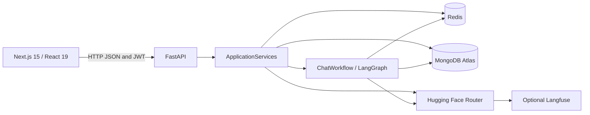
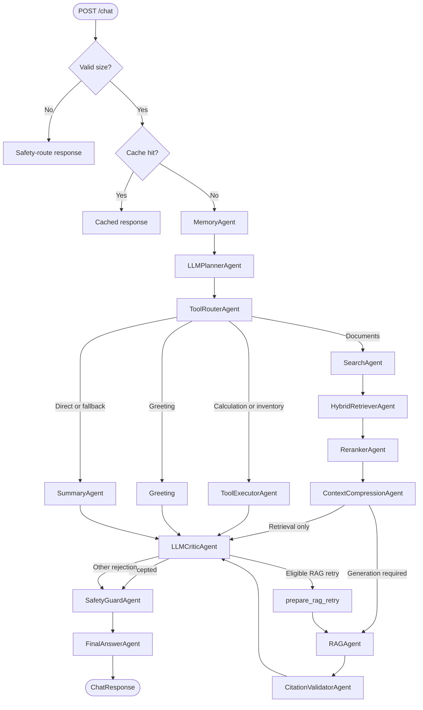

# Project guide — Agentic RAG Platform

> Historical guide, verified against `architecture-improvements` on **August 30, 2026**. It describes the older architecture, including components and configuration later changed or removed. Use [ARCHITECTURE_AGENT.md](ARCHITECTURE_AGENT.md) for the current collaborative graph and [ARCHITECTURE_SIMPLIFIEE.md](ARCHITECTURE_SIMPLIFIEE.md) for the intermediate baseline.

## 1. Objective and scope

Agentic RAG Platform is a chat application that chooses between direct answers and document-grounded answers. The backend orchestrates specialized agents through LangGraph, exposes execution details in JSON and the frontend displays them in a debugging workspace.

The project demonstrated conditional orchestration rather than a fixed list of calls; hybrid Atlas Search/Vector Search retrieval; Pydantic-validated planner and critic decisions; degraded modes for Redis, MongoDB, embeddings and LLM failures; and visible routes, agents, metrics and raw outputs.

This was an advanced learning starter. Its safeguards and evaluations were not sufficient to establish enterprise readiness.

## 2. Overall architecture



### Backend lifecycle

`backend/app/main.py` uses FastAPI lifespan to create one `ApplicationServices` per worker. The container shares `RedisMemoryService`, `SearchService` and its PyMongo client, `HuggingFaceEmbeddingService`, `LLMService` with `AsyncOpenAI`, `AuthService` and a once-compiled `ChatWorkflow`.

Shutdown closes Redis, MongoDB and LLM clients. This replaced service construction at router module scope.

### I/O and concurrency

- LLM calls use the asynchronous `AsyncOpenAI` client.
- Runtime Redis operations use `redis.asyncio`.
- PyMongo remains synchronous; aggregation, bulk writes, the historical insertion fallback and deletion are offloaded with `asyncio.to_thread`.
- Upload copying is offloaded to a thread.
- PDF/CSV parsing follows locally and synchronously, so large files can occupy an API worker.
- Startup Redis and MongoDB probes are synchronous before requests are served.

## 3. Repository layout

```text
backend/app/main.py                 FastAPI creation, lifespan, middleware
backend/app/service_container.py    shared process resources
backend/app/routers/                health, auth, chat, ingestion, reset
backend/app/workflows/              main LangGraph workflow
backend/app/agents/                 specialized agents and fallbacks
backend/app/state/                  GraphState dataclass and graph TypedDict
backend/app/services/               LLM, embeddings, MongoDB, auth, JWT
backend/app/memory/                 Redis and local-memory fallback
backend/app/data_ingest/            PDF/CSV readers
backend/app/prompts/                centralized prompts
backend/app/evaluation/             chat evaluator and retrieval benchmark
backend/app/middleware/             HTTP logs, rate limits, security headers
backend/tests/                      backend unit tests
frontend/app/page.tsx               UI, API calls and diagnostics
frontend/app/globals.css            themes and global styles
docs/                              technical documentation
```

## 4. Stack at the historical revision

| Area | Technology | Use at that revision |
|---|---|---|
| API | FastAPI, Uvicorn, Pydantic | HTTP routes and validation |
| Orchestration | LangGraph `StateGraph` | Conditional 19-node graph |
| Tools | Calculator, inventory, citation validator | Local controlled execution |
| LLM | Hugging Face Router through `AsyncOpenAI` | Planning, direct answers, RAG, critic |
| Embeddings | Hugging Face feature-extraction through `httpx` | Ingestion, vector search, reranking |
| Documents | MongoDB Atlas | Shared collection, text/vector indexes |
| History/cache/accounts | Redis | Message lists and key/value records |
| Authentication | PyJWT, Passlib PBKDF2-SHA256 | JWTs and password hashing |
| Observability | Loguru, optional Langfuse | Structured logs and LLM traces |
| Frontend | Next.js 15, React 19, TypeScript | Authentication, chat, ingestion, diagnostics |
| Files | PyPDF2, standard `csv` | One PDF page or CSV row per record |

At this revision, `Settings.llm_provider` accepted `ollama` or `huggingface`, but only Hugging Face was implemented and the Ollama endpoint/model fields were unused. This is historical behavior; the current project defaults to Hugging Face and retains an optional Ollama client.

## 5. HTTP API

The default prefix is `/api/v1`.

| Method and route | Authentication | Historical purpose |
|---|---|---|
| `GET /health` | No | Backend/Redis/MongoDB status and configured provider |
| `POST /api/v1/auth/register` | No | Create a Redis account with a hashed password |
| `POST /api/v1/auth/login` | No | Return a JWT |
| `GET /api/v1/auth/me` | Yes | Validate JWT and account existence |
| `POST /api/v1/chat` | Yes | Use the historical cache or run LangGraph |
| `GET /api/v1/conversations/{id}/context` | Yes | Read Redis history |
| `DELETE /api/v1/conversations/{id}/context` | Yes | Clear that history |
| `POST /api/v1/ingest/sample-data` | Yes | Index `ai_tooling_catalog.csv` |
| `POST /api/v1/ingest/upload` | Yes | Store and index one PDF/CSV |
| `POST /api/v1/ingest/batch` | Yes | Index PDF/CSV files from a server directory |
| `DELETE /api/v1/data/reset` | Yes | Clear documents and runtime data |

`/health` does not make a test LLM call. `llm_provider` describes configuration, not availability, quota or key validity.

### Historical chat contract

```json
{
  "message": "Summarize the indexed document",
  "conversation_id": null,
  "history": [{"role": "assistant", "content": "..."}]
}
```

The historical response contained `conversation_id`, `route`, `answer`, `agents_used`, `agent_results`, `tool_results`, `cached`, `context_messages`, `plan`, critic/safety fields, `retrieval_metrics`, `evaluation` and `trace_id`. The current API no longer uses an answer cache.

## 6. Historical chat workflow

Before LangGraph, `ChatWorkflow.run()` selected a conversation ID, loaded Redis context, rejected oversized messages, checked the answer cache and, on a miss, appended the user message. It then ran the graph, stored the assistant response and cached it.



The historical graph had 19 nodes: 14 associated with agent classes and five technical nodes (`greeting`, `skip_critic`, `skip_safety`, `prepare_rag_retry`, `prepare_summary_retry`). See [AGENTS.md](AGENTS.md) for the current structure.

### Historical routing details

- `PlannerDecision.requires_critic` and `requires_safety` controlled quality gates. Generative/RAG routes used the critic by default; deterministic routes could skip it.
- `document_qa` with `requires_rag=False` still retrieved, fused, reranked and compressed, then went directly to the critic.
- RAG retry required `route="rag"` and available documents.
- A rejected direct answer could use `prepare_summary_retry` once; the second verdict proceeded to safety to bound execution.
- Calculation and inventory executed only authorized tools, then passed through critic, safety and finalization.

## 7. Shared state and graph observability

Agents use the `GraphState` dataclass; LangGraph uses `GraphStateDict`. Conversion occurs at node boundaries.

Field groups include identity (`conversation_id`, `transaction_id`, `user_message`), context (`history`, `conversation_context`), decisions (`intent`, `route`, `plan`, `tools`, `planner_decision`), tool results, retrieval results/context, generated drafts, critic/safety state and correction flags. Output/debug fields include `final_answer`, `agents_used`, `agent_results`, `retrieval_metrics`, `evaluation`, `metadata` and `error`.

Node wrappers measure `evaluation.latency_ms[NodeName]`. `record_result()` preserves raw results while deduplicating `agents_used`: repeated agent invocations appear once in the name list but retain separate result records.

### Deterministic tools

`ToolExecutorAgent` accepts two registered routes: `calculation` uses an AST calculator without `eval` and bounds expression length, complexity, exponents and results; `document_list` scans at most 200 MongoDB records and groups them by source/file.

After RAG generation, `CitationValidatorTool` checks that numeric labels exist and refer to supplied documents. In this historical workflow, failure forced critic rejection and could trigger the one RAG retry. Structural citations do not prove that the cited sentence follows from its source.

## 8. Historical memory and cache

| Use | Key | Expiration |
|---|---|---:|
| Account | `user:<email>` | None (`ttl=-1`) |
| Conversation | `conversation:<owner_hash>:<id>:messages` | `REDIS_TTL_SECONDS` |
| Chat answer | `chat:<owner_hash>:<id>:docs:<version>:<message>` | `REDIS_TTL_SECONDS` |

The historical cache matched normalized messages (`strip().lower()`) and included an owner hash and `documents:version`. Ingestion/reset incremented the version. Prompts and models were not versioned. Cache hits ran no agents and did not append repeated messages. Later revisions removed this answer cache.

Redis failures fall back to local Python storage. Runtime failures after initial connection also use fallback, but existing Redis data is not replicated locally. Local storage is nonpersistent and not shared between workers.

## 9. Historical ingestion and storage

### Formats

At the time of this guide, each nonempty PDF page became one record, truncated to 5,000 characters, with page number and file name. CSV required `title`, `snippet`, `category`, with optional `source`, and produced one record per row. The later audit replaced truncation with shared overlapping chunking.

### Ingestion paths

- `sample-data` reads the bundled CSV catalog.
- `upload` accepts PDF/CSV, normalizes names through `Path(filename).name`, stores under `backend/data/` and adds a UUID suffix on collision.
- `batch` reads a directory under `BATCH_INGEST_ROOT`, nonrecursive by default, with extension filters and optional administrator requirements.

Before insertion, the service attempts batch embeddings of title and snippet. Failure retains text-searchable documents. Stable IDs, in-memory deduplication and upserts limit duplicates. Records carry `owner_id` and `visibility`; owner mode includes the user's records plus shared records. Upload size, batch file count, fragment count and snippet size are bounded by configuration.

Reset preserves `user:*` accounts and Atlas indexes. In owner mode, non-admin users clear only their own documents/runtime; configured administrators can perform global reset.

## 10. Historical frontend

The frontend is a client component in `frontend/app/page.tsx`.

### Session

JWT and email are stored in `localStorage`. A saved token is checked through `/auth/me` before the workspace opens. Registration is followed by automatic login. Main-action `401` responses trigger local logout.

### Workspace

Chat supports a send button and Cmd/Ctrl+Enter. Local history accompanies requests, including the initial welcome message while present. Upload supports PDF/CSV drag-and-drop. The historical `INGESTION DATA` button calls `/ingest/batch` without a body to process backend `data`; despite the TypeScript function's old name, it does not call `/ingest/sample-data`.

Reset requires confirmation. Health checks occur initially, manually and after ingestion/upload/reset, without periodic polling. Light/dark themes persist; layouts adapt to desktop/tablet/mobile and desktop panels are resizable.

### Diagnostics

The workspace shows route, agents, tools, historical cache status, plan, critic, safety, retrieval metrics, trace ID and raw agent results. The activity column contains frontend events, not streamed Loguru logs.

Safari may report a raw `Load failed` network error. This usually indicates backend connectivity, port or CORS problems and does not itself prove a RAG failure.

## 11. Authentication and security

Passwords use PBKDF2-SHA256. JWT algorithm and expiry are configurable, with a 120-minute default. Outside development/local/test, the backend rejects the default authentication secret. CORS uses explicit origins plus a private-LAN regex only in development/local mode.

Per-IP rate limiting uses Redis when available, otherwise local counters; `/health` is exempt. Security headers include frame denial, nosniff, CSP, referrer and permissions policies. Output safety masks recognizable secrets; optional LLM safety review exists but is disabled in the workflow. Prompts separate question, evidence and history, mark source content untrusted and require grounding/citations.

Limitations include no JWT revocation, no fine-grained roles, email-based document ownership rather than dedicated tenancy, incomplete prompt-injection protection, possible secrets in diagnostic outputs/logs, and ingestion parsing within API workers.

## 12. Configuration at the historical revision

| Variable | Historical default | Note |
|---|---|---|
| `LLM_PROVIDER` | `ollama` | Only Hugging Face was implemented at that revision |
| `HUGGINGFACE_API_KEY` | Empty | Needed for generation and embeddings |
| `MODEL_*` | Capability-dependent | Model overrides |
| `MODEL_EMBEDDING` | `BAAI/bge-small-en-v1.5` | Expected dimension 384 |
| `SEMANTIC_RERANKER_ENABLED` | `true` | Controls semantic reranking only |
| `REDIS_URL` | `redis://localhost:6379/0` | Local fallback after connection failure |
| `REDIS_TTL_SECONDS` | `3600` | Conversation and historical cache expiry |
| `MONGODB_URI` | Empty | Retrieval/ingestion unavailable when unset |
| `MONGODB_SEARCH_INDEX` | `documents_search` | Must exist in Atlas |
| `MONGODB_VECTOR_INDEX` | `documents_vector` | Indexes `embedding` |
| `DOCUMENT_SCOPE_MODE` | Local shared / otherwise owner | Per-user document scope |
| `DOCUMENT_DEFAULT_VISIBILITY` | Local shared / otherwise private | Ingested fragment visibility |
| `MAX_UPLOAD_BYTES` | `10485760` | Upload size limit |
| `MAX_BATCH_FILES` | `20` | Batch file limit |
| `MAX_INGEST_DOCUMENTS` | `500` | Fragment limit per request |
| `MAX_USER_MESSAGE_CHARS` | `8000` | Workflow input limit |
| `MAX_RAG_CONTEXT_CHARS` | `4000` | Local context compression |
| `MAX_RAG_DOCUMENTS` | `5` | Post-reranking document count |
| `RATE_LIMIT_REQUESTS_PER_MINUTE` | `60` | HTTP rate limit |
| `CITATION_SUPPORT_REQUIRED` | `false` | Informative or blocking lexical support |
| `LLM_TIMEOUT_SECONDS` | `60` | Generation client timeout |
| `LANGFUSE_ENABLED` | `false` | Example environment enabled it |
| `LANGGRAPH_CHECKPOINT_ENABLED` | `false` | Historical MemorySaver option |
| `AUTH_TOKEN_EXPIRY_MINUTES` | `120` | JWT lifetime |

At that revision, `EMBEDDING_DIMENSIONS` was loaded but not used for application-level vector validation. The later audit added validation. Current settings and examples supersede this table.

## 13. Startup and diagnostics

Copy environment examples only when destination files do not already exist:

```sh
cp backend/.env.example backend/.env
cp frontend/.env.example frontend/.env.local
make install
make dev
```

Expected addresses: frontend `http://localhost:3000`, backend `http://localhost:8000`, OpenAPI `http://localhost:8000/docs`.

```sh
curl http://127.0.0.1:8000/health
lsof -nP -iTCP:8000 -sTCP:LISTEN
lsof -nP -iTCP:3000 -sTCP:LISTEN
```

`clear` only clears terminal display; it does not release ports. For `Address already in use`, identify the process using the port, stop it if appropriate or select another port and align `NEXT_PUBLIC_BACKEND_URL`.

## 14. Observability and tests

Loguru writes to console and, by default, rotating `backend/logs/multi-agent-backend.log`. HTTP middleware creates `X-Request-ID`; workflow context adds session/transaction/agent/route and node latency.

Checks recorded on August 30, 2026:

```sh
make test                       # 32 backend tests passed at that revision
cd frontend && npm run build    # Next.js build and type checks passed
```

See [EVALUATION.md](EVALUATION.md) for current evaluation guidance and retrieval benchmarks.

## 15. Priorities recorded at that revision

1. Add explicit roles/tenants and migrate legacy document ownership.
2. Test actual LLM readiness or clarify the model status indicator.
3. Move expensive PDF/CSV ingestion to a job queue.
4. Add an administrator UI for batch/reset operations.
5. Calibrate or fuse dense/sparse scores.
6. Add frontend/API/load tests and groundedness/hallucination evaluation.
7. Implement Ollama or remove its configuration option.

Some of these items were addressed in later revisions. See [RAG_SYSTEM.md](RAG_SYSTEM.md) for current retrieval behavior and limitations.
