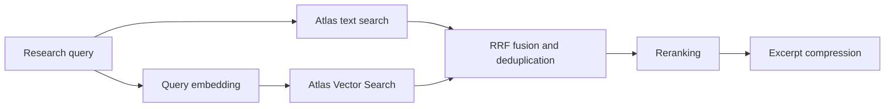

# Current document pipeline

The current workflow uses Hugging Face and four collaborating agents, followed by local checks. The team may make one correction and uses at most thirteen LLM calls within a default 90-second deadline. See [ARCHITECTURE_AGENT.md](ARCHITECTURE_AGENT.md).

## Ingestion

`sample-data`, `upload` and `batch` share normalization and document preparation. PDF extraction preserves page boundaries; CSV requires `title`, `snippet` and `category`, with optional `source`. Long text is split with overlap without dropping its end. Fragments include owner, visibility, page, logical file name and stable ID; successful vectorization adds an embedding and model provenance.

Embeddings are requested in batches of 32 and validated for count, dimension, finite numeric values and nonzero vectors. Failure leaves an explicitly reported text-only mode through `warnings` and `embedded_count`. Successful ingestion means a MongoDB write, not immediate Atlas index synchronization.

Upserts do not double-count `matched_count` and `modified_count`. Identical reingestion can preserve an existing vector if the provider fails; `embedded_count` describes vectors prepared for this request, not a database recount. Index diagnostics inspect persisted data.

There is no response cache. Ingestion no longer depends on Redis to increment a cache version. Redis remains responsible for authentication and conversation history/reset.

## Parallel retrieval shared by chat and benchmark

`HybridRetrieverAgent.run_parallel` starts text and vector retrieval together. Each branch has its own state and receives the same query and owner. After both finish, RRF combines the results; reranking and compression follow.



`retrieval_status` is `ok`, `degraded` if one branch fails, or `unavailable` if both fail. Empty lists without errors remain a technical success. Hits from an available branch are retained. Errors expose their type, not raw provider text. Cancellation stops both asynchronous waits; an already running PyMongo thread may finish later.

`retrieval_latency_ms` reports `search`, `vector_search`, `parallel_search` (actual combined wall time) and `hybrid_fusion`. Do not sum branch durations to obtain parallel latency. One documentary tool call still counts as one agent search, even though it runs two retrieval branches.

`RetrievalPipeline` assembles four components:

1. **Text retrieval:** Atlas Search over title, snippet and category, at most five hits, access filters applied.
2. **Hybrid retrieval:** vector search with owner/shared prefilter, RRF fusion and at most eight results. A document receives at most one vote per branch. `vector_error` distinguishes an outage from no hits.
3. **Reranking:** lexical ranking, optionally enriched by cosine similarity when `SEMANTIC_RERANKER_ENABLED=true`. Stored embeddings are reused; incompatible dimensions trigger lexical fallback. Final selection is bounded by `MAX_RAG_DOCUMENTS`.
4. **Compression:** local extractive selection under `MAX_RAG_CONTEXT_CHARS`. Preserved labels identify the evidence available to generation and validation.

There is no online CRAG grader. These four technical components do not generate LLM answers; embeddings remain separate network calls.

## Generation, collaboration and validation

The planner provides an objective and subquestions. The researcher sees the question, history, plan, observations and selected passages. It can search, read a discovered fragment, draft an answer, clarify or abstain. The synthesizer writes from that evidence; the verifier may request additional research or a writing correction. The team permits one return, at most four searches, six tools and thirteen LLM calls overall. The simple `baseline` retains at most one generation call.

Citation checks validate presence and range with optional lexical support controlled by `CITATION_SUPPORT_REQUIRED`. They do not establish semantic entailment or assign a truth score. Local validation failure causes abstention without regeneration. Arithmetic and inventory tools do not use the generator.

## Indexes and migration

```sh
cd backend
.venv/bin/python -m app.evaluation.index_health
.venv/bin/python -m app.evaluation.index_health --vector-definition
```

The vector index must declare `embedding` with the correct dimension and `owner_id`/`visibility` as filter fields for owner mode. Documents and queries must use the same embedding model. See the [MongoDB Vector Search stage](https://www.mongodb.com/docs/vector-search/query/aggregation-stages/vector-search-stage/).

Graph changes do not change storage identities. The earlier ID migration remains separate: read [AUDIT_2026-09-10.md](AUDIT_2026-09-10.md) before reingesting an existing corpus.

## Web search

`rechercher_web` uses Tavily in automatic mode with `TAVILY_API_KEY`. It shares the two-search-per-pass budget with documentary retrieval, allowing at most four searches when correction is used. URLs become evidence for synthesis and verification. Documents-only mode blocks this tool. Web results are not ingested into MongoDB or reread through the MongoDB passage tool.

## Current limitations

No OCR or robust reconstruction of PDF tables and columns. Chunking is character-based, not token-based. The default embedding model and some lexical heuristics favor English. The researcher can reformulate using history, but conversational resolution quality still needs evaluation. Candidate limits and thresholds require calibration on business data. Changed file versions do not automatically remove older fragments.

Semantic reranking and experimental components must be evaluated against the same text/hybrid reference path. Their presence does not guarantee better answers. Local tests cover concurrent start, identical fusion, outages, cancellation and owner isolation; provider-backed quality remains a separate evaluation.
